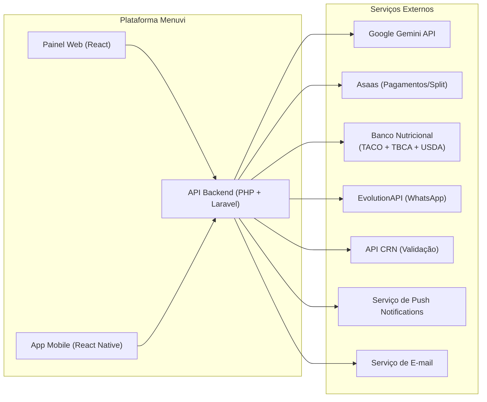
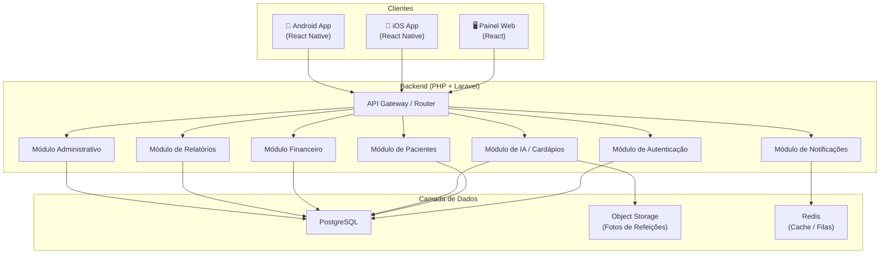
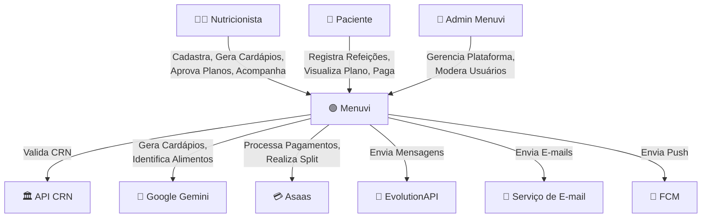
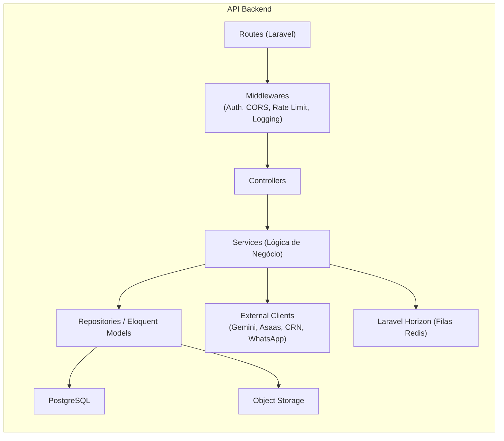

# 📋 Menuvi — Documento de Especificação de Requisitos de Software (SRS)

> **Documento:** Especificação de Requisitos de Software (SRS)  
> **Padrão de referência:** IEEE 830-1998 / ISO/IEC/IEEE 29148:2018 (adaptado)  
> **Produto:** Menuvi (`menuvi.com.br`)  
> **Versão do Documento:** 1.0.3  
> **Data de Criação:** 11/09/2026  
> **Última Atualização:** 13/09/2026  
> **Autor:** Mateus Serafim  
> **Status:** Em Elaboração  

---

## Controle de Versões

| Versão | Data       | Autor           | Descrição da Alteração                                                                 |
|:------:|:----------:|:----------------|:---------------------------------------------------------------------------------------|
| 1.0.0  | 11/09/2026 | Mateus Serafim  | Criação inicial do documento de requisitos                                             |

---

## Índice

1. [Introdução](#1-introdução)
   1. [Propósito](#11-propósito)
   2. [Escopo do Produto](#12-escopo-do-produto)
   3. [Definições, Acrônimos e Abreviações](#13-definições-acrônimos-e-abreviações)
   4. [Referências](#14-referências)
   5. [Visão Geral do Documento](#15-visão-geral-do-documento)
2. [Descrição Geral](#2-descrição-geral)
   1. [Perspectiva do Produto](#21-perspectiva-do-produto)
   2. [Funções do Produto](#22-funções-do-produto)
   3. [Características dos Usuários](#23-características-dos-usuários)
   4. [Restrições](#24-restrições)
   5. [Suposições e Dependências](#25-suposições-e-dependências)
3. [Arquitetura de Alto Nível](#3-arquitetura-de-alto-nível)
   1. [Visão Arquitetural](#31-visão-arquitetural)
   2. [Stack Tecnológica](#32-stack-tecnológica)
   3. [Diagrama de Contexto](#33-diagrama-de-contexto)
   4. [Diagrama de Componentes](#34-diagrama-de-componentes)
4. [Requisitos Funcionais](#4-requisitos-funcionais)
   1. [Módulo de Autenticação e Cadastro](#41-módulo-de-autenticação-e-cadastro)
   2. [Módulo de Gestão de Pacientes](#42-módulo-de-gestão-de-pacientes)
   3. [Módulo de Geração Assistida por IA](#43-módulo-de-geração-assistida-por-ia)
   4. [Módulo de Diário Alimentar](#44-módulo-de-diário-alimentar)
   5. [Módulo Financeiro](#45-módulo-financeiro)
   6. [Módulo de Notificações](#46-módulo-de-notificações)
   7. [Módulo de Relatórios e Dashboards](#47-módulo-de-relatórios-e-dashboards)
   8. [Módulo Administrativo (Backoffice)](#48-módulo-administrativo-backoffice)
5. [Requisitos Não Funcionais](#5-requisitos-não-funcionais)
   1. [Performance](#51-performance)
   2. [Segurança](#52-segurança)
   3. [Disponibilidade](#53-disponibilidade)
   4. [Escalabilidade](#54-escalabilidade)
   5. [Usabilidade](#55-usabilidade)
   6. [Manutenibilidade](#56-manutenibilidade)
   7. [Internacionalização](#57-internacionalização)
6. [Regras de Negócio](#6-regras-de-negócio)
7. [Requisitos de Dados](#7-requisitos-de-dados)
   1. [Requisitos de Armazenamento](#71-requisitos-de-armazenamento)
8. [Requisitos de Interface](#8-requisitos-de-interface)
   1. [Interfaces de Usuário](#81-interfaces-de-usuário)
   2. [Interfaces de Software (APIs e Integrações)](#82-interfaces-de-software-apis-e-integrações)
   3. [Interfaces de Hardware](#83-interfaces-de-hardware)
9. [Conformidade Legal e Regulatória](#9-conformidade-legal-e-regulatória)
   1. [LGPD](#91-lgpd)
   2. [Legislação Profissional](#92-legislação-profissional)
   3. [Regulação Financeira](#93-regulação-financeira)
10. [Matriz de Rastreabilidade](#10-matriz-de-rastreabilidade)
11. [Critérios de Aceitação do MVP](#11-critérios-de-aceitação-do-mvp)
12. [Escopo Excluído (Backlog Futuro)](#12-escopo-excluído-backlog-futuro)
13. [Glossário](#13-glossário)
14. [Aprovações](#14-aprovações)

---

## 1. Introdução

### 1.1 Propósito

Este documento especifica os requisitos funcionais e não funcionais do sistema **Menuvi**, uma plataforma SaaS B2B2C que atua como copiloto inteligente do nutricionista e ponte diária com o paciente. O documento destina-se a:

- **Equipe de desenvolvimento** — como guia técnico para implementação.
- **Product Owner / Stakeholders** — como contrato funcional do que será entregue no MVP.
- **Equipe de QA** — como base para elaboração de casos de teste.
- **Consultoria jurídica** — como referência para validação de conformidade regulatória.

### 1.2 Escopo do Produto

O **Menuvi** é uma plataforma digital composta por:

1. **Aplicativo Mobile (iOS + Android)** — utilizado por nutricionistas (funcionalidades simplificadas em campo) e pacientes (consumo de planos e registro de refeições).
2. **Painel Web (Desktop)** — utilizado por nutricionistas (gestão completa de pacientes, geração e edição de cardápios, dashboards e relatórios) e pela equipe administrativa do Menuvi (backoffice).
3. **API Backend** — serviço centralizado que processa toda a lógica de negócio, integrações com IA, gateway de pagamento e persistência de dados.

**Objetivo primário:** Reduzir o tempo que o nutricionista gasta montando planos alimentares e acompanhando a adesão dos pacientes, utilizando IA como assistente com supervisão humana obrigatória (human-in-the-loop).

**Objetivo secundário:** Intermediar a relação financeira entre nutricionista e paciente com transparência e split de pagamento automatizado.

### 1.3 Definições, Acrônimos e Abreviações

| Sigla/Termo      | Definição                                                                                     |
|:-----------------|:----------------------------------------------------------------------------------------------|
| **SRS**          | Software Requirements Specification (Especificação de Requisitos de Software)                 |
| **MVP**          | Minimum Viable Product (Produto Mínimo Viável)                                               |
| **B2B2C**        | Business-to-Business-to-Consumer                                                             |
| **SaaS**         | Software as a Service                                                                        |
| **CRN**          | Conselho Regional de Nutricionistas                                                          |
| **CFN**          | Conselho Federal de Nutricionistas                                                            |
| **TACO**         | Tabela Brasileira de Composição de Alimentos (NEPA/UNICAMP) — 4ª Edição                      |
| **TBCA**         | Tabela Brasileira de Composição de Alimentos (FoRC/USP) — base online atualizada continuamente |
| **USDA**         | United States Department of Agriculture — FoodData Central (tabela internacional de referência) |
| **IBGE**         | Instituto Brasileiro de Geografia e Estatística (POF — Pesquisa de Orçamentos Familiares)    |
| **LGPD**         | Lei Geral de Proteção de Dados (Lei nº 13.709/2018)                                         |
| **LLM**          | Large Language Model (Modelo de Linguagem de Grande Escala)                                   |
| **HITL**         | Human-in-the-Loop (Humano no Circuito)                                                       |
| **2FA**          | Two-Factor Authentication (Autenticação em Dois Fatores)                                      |
| **DPA**          | Data Processing Agreement (Contrato de Processamento de Dados)                               |
| **SLA**          | Service Level Agreement (Acordo de Nível de Serviço)                                         |
| **PWA**          | Progressive Web App                                                                          |
| **VPS**          | Virtual Private Server                                                                       |

### 1.4 Referências

| Referência                                           | Descrição                                                        |
|:-----------------------------------------------------|:-----------------------------------------------------------------|
| IEEE 830-1998                                        | Padrão para Especificação de Requisitos de Software              |
| ISO/IEC/IEEE 29148:2018                              | Engenharia de Sistemas e Software — Processos de Requisitos      |
| Lei nº 13.709/2018 (LGPD)                            | Lei Geral de Proteção de Dados Pessoais do Brasil                |
| Lei nº 8.234/1991                                    | Regulamentação da profissão de Nutricionista                     |
| Resolução CFN nº 599/2018                            | Código de Ética e Conduta do Nutricionista                       |
| Tabela TACO (NEPA/UNICAMP) — 4ª Edição              | Tabela Brasileira de Composição de Alimentos (referência nacional)      |
| TBCA (FoRC/USP) — tbca.net.br                       | Tabela Brasileira de Composição de Alimentos da USP (base atualizada)   |
| USDA FoodData Central — fdc.nal.usda.gov             | Base internacional de composição de alimentos (complementar)            |
| [PLANEJAMENTO-FINAL.md](file:///home/mateus.serafim@ad.fcv.local/Dev/saas-fit/PLANEJAMENTO-FINAL.md) | Documento de planejamento e especificação inicial do Menuvi |

### 1.5 Visão Geral do Documento

Este documento é a especificação central e completa dos requisitos de software do sistema Menuvi, estruturado nas seguintes seções:

- **Seção 2** descreve o produto de forma geral, seus atores, restrições e premissas.
- **Seção 3** apresenta a arquitetura de alto nível e a stack tecnológica (PHP 8.5+, Laravel 13, PostgreSQL 18+, React Native, React 18+).
- **Seção 4** detalha exaustivamente todos os 41 Requisitos Funcionais (RF-001 a RF-041), agrupados pelos 8 módulos do sistema.
- **Seção 5** especifica todos os 36 Requisitos Não Funcionais (RNF-001 a RNF-036).
- **Seção 6** consolida as 20 Regras de Negócio mandatórias (RN-01 a RN-20).
- **Seções 7 e 8** cobrem os requisitos de armazenamento de dados e as interfaces de software/hardware.
- **Seção 9** detalha a conformidade legal e regulatória (LGPD, CFN e regulação financeira).
- **Seções 10 a 14** incluem a Matriz de Rastreabilidade, Critérios de Aceitação do MVP, Escopo Excluído, Glossário e Registro de Aprovações.

---

## 2. Descrição Geral

### 2.1 Perspectiva do Produto

O Menuvi é um sistema novo e independente, sem dependência de sistemas legados. Ele se integra com serviços externos para funcionalidades específicas:



### 2.2 Funções do Produto

As funções principais do Menuvi, agrupadas por domínio:

| ID   | Função                                      | Descrição Resumida                                                                                         |
|:----:|:--------------------------------------------|:-----------------------------------------------------------------------------------------------------------|
| F01  | Cadastro e Validação Profissional           | Registro do nutricionista com verificação ativa do CRN                                                     |
| F02  | Autenticação Multi-método                   | Login via e-mail/senha e login social (Google/Apple)                                                       |
| F03  | Gestão de Pacientes por Convite             | Convite individual de pacientes via link exclusivo, com onboarding e anamnese configurável (com template padrão do sistema) |
| F04  | Geração de Cardápios Assistida por IA       | IA gera rascunhos de cardápios com base nas Tabelas TACO, TBCA e USDA, com período flexível (1–30 dias)    |
| F05  | Editor de Cardápios                         | Editor visual para o nutricionista ajustar alimentos, quantidades e observações                             |
| F06  | Aprovação e Publicação de Planos            | Trava de segurança: plano só chega ao paciente após aprovação formal do nutricionista                       |
| F07  | Diário Alimentar com Foto e Visão Computacional | Paciente fotografa refeições; IA identifica alimentos automaticamente                                  |
| F08  | Painel de Adesão                            | Timeline diária de adesão de cada paciente para o nutricionista                                             |
| F09  | Intermediação Financeira com Split           | Cobranças automáticas do paciente com split de pagamento para o nutricionista via Asaas                    |
| F10  | Sistema de Notificações Multi-canal          | Push, e-mail, WhatsApp (EvolutionAPI) e in-app                                                            |
| F11  | Dashboards e Relatórios                     | KPIs, adesão, evolução do paciente, financeiro e exportação PDF/CSV                                        |
| F12  | Backoffice Administrativo                   | Painel completo para a equipe Menuvi (CRUD de usuários, financeiro, métricas)                               |

### 2.3 Características dos Usuários

#### 2.3.1 Nutricionista (Usuário Primário — B2B)

| Atributo                  | Descrição                                                                                |
|:--------------------------|:-----------------------------------------------------------------------------------------|
| **Perfil**                | Profissional graduado em Nutrição, registrado no CRN                                     |
| **Faixa etária esperada** | 22–55 anos                                                                               |
| **Nível técnico**         | Intermediário (familiarizado com apps e softwares de escritório)                          |
| **Motivação principal**   | Reduzir tempo manual de criação de cardápios e melhorar retenção de pacientes             |
| **Frequência de uso**     | Diária (painel web) e semanal (app mobile em campo)                                      |
| **Dispositivos**          | Desktop/laptop (painel web) + smartphone (app mobile)                                    |

#### 2.3.2 Paciente (Usuário Convidado — B2C)

| Atributo                  | Descrição                                                                                |
|:--------------------------|:-----------------------------------------------------------------------------------------|
| **Perfil**                | Adulto (18+) acompanhado por nutricionista cadastrado no Menuvi                          |
| **Faixa etária esperada** | 18–65 anos                                                                               |
| **Nível técnico**         | Básico a intermediário                                                                   |
| **Motivação principal**   | Conveniência para seguir o plano e registrar refeições                                    |
| **Frequência de uso**     | Diária (registro de refeições)                                                           |
| **Dispositivos**          | Smartphone (app mobile — acesso exclusivo)                                               |

#### 2.3.3 Administrador Menuvi (Backoffice)

| Atributo                  | Descrição                                                                                |
|:--------------------------|:-----------------------------------------------------------------------------------------|
| **Perfil**                | Membro da equipe operacional do Menuvi                                                   |
| **Nível técnico**         | Avançado                                                                                 |
| **Motivação principal**   | Gerenciar a plataforma, moderar usuários e monitorar métricas                             |
| **Frequência de uso**     | Diária                                                                                   |
| **Dispositivos**          | Desktop (painel web)                                                                     |

### 2.4 Restrições

| ID    | Restrição                                                                                                  |
|:-----:|:-----------------------------------------------------------------------------------------------------------|
| R01   | O sistema **não deve** gerar prescrições nutricionais autônomas (sem aprovação do nutricionista)            |
| R02   | Todo plano alimentar **deve** passar pela aprovação formal do nutricionista antes de ser visível ao paciente |
| R03   | Os valores nutricionais (calorias, macros, micros) **devem** ser obtidos exclusivamente das Tabelas TACO, TBCA e/ou USDA |
| R04   | A IA **não deve** inventar, interpolar ou estimar valores nutricionais não presentes no banco de dados      |
| R05   | O sistema **não deve** atender menores de 18 anos no MVP                                                   |
| R06   | O sistema **não deve** realizar custódia direta de valores financeiros (uso obrigatório de gateway regulado) |
| R07   | O paciente **só pode** acessar a plataforma mediante convite de um nutricionista cadastrado                 |
| R08   | O sistema **deve** operar em conformidade com a LGPD (Lei nº 13.709/2018)                                  |
| R09   | O MVP **deve** suportar apenas o idioma Português (Brasil)                                                  |
| R10   | A plataforma **não deve** oferecer teleconsulta/videochamada no MVP                                         |

### 2.5 Suposições e Dependências

| ID    | Suposição / Dependência                                                                                    |
|:-----:|:-----------------------------------------------------------------------------------------------------------|
| S01   | A API do CRN estará disponível e acessível para validação automatizada de registros profissionais           |
| S02   | As Tabelas TACO (4ª edição), TBCA (FoRC/USP) e USDA (FoodData Central) serão normalizadas e carregadas em banco relacional próprio, com a ordem de prioridade de consulta sendo configurável pelo nutricionista (padrão inicial: TACO > TBCA > USDA) |
| S03   | O serviço Asaas estará operacional e com funcionalidade de split de pagamentos ativa                       |
| S04   | A EvolutionAPI estará disponível e funcional para envio de mensagens via WhatsApp                            |
| S05   | O Google Gemini API estará acessível com latência aceitável (< 10s para geração de cardápios)              |
| S06   | O nutricionista possui conexão à internet estável para uso do painel web                                   |
| S07   | O paciente possui smartphone com câmera funcional e acesso à internet                                      |
| S08   | Os serviços de push notification (FCM/APNs) estarão disponíveis                                            |

---

## 3. Arquitetura de Alto Nível

### 3.1 Visão Arquitetural

O Menuvi adota uma arquitetura monolítica modular no MVP, utilizando a estrutura de módulos/domínios do Laravel com separação clara de responsabilidades, facilitando uma futura migração para microsserviços se necessário.



### 3.2 Stack Tecnológica

| Camada             | Tecnologia                          | Justificativa                                                           |
|:-------------------|:------------------------------------|:------------------------------------------------------------------------|
| **Backend**        | PHP 8.5+ com framework Laravel 13   | Ecossistema de ponta, alta performance (JIT aprimorado), Eloquent ORM, filas nativas (Horizon), comunidade massiva no Brasil |
| **Frontend Web**   | React 18+ (TypeScript)              | Ecossistema maduro, componentização, compatibilidade com React Native   |
| **Mobile**         | React Native (TypeScript)           | Codebase unificado para iOS e Android, compartilhamento de tipos        |
| **Banco de Dados** | PostgreSQL 18+                      | Robusto, alta performance, recursos avançados de JSON, extensões de busca vetorial/textual e conformidade ACID estrita |
| **Cache/Filas**    | Redis 7+ com Laravel Horizon         | Filas de processamento assíncrono (Horizon), cache de sessões, rate limiting |
| **Object Storage** | MinIO ou S3-compatible (na VPS)      | Armazenamento de fotos de refeições com criptografia em repouso         |
| **IA/LLM**         | Google Gemini API                   | Geração de rascunhos de cardápios com saída JSON estruturada             |
| **Visão Computacional** | Google Gemini (multimodal)     | Identificação de alimentos em fotos de refeições                         |
| **Pagamentos**     | Asaas (Split de Pagamentos)         | Gateway brasileiro com split nativo, sem custódia direta                |
| **WhatsApp**       | EvolutionAPI                        | Integração WhatsApp sem dependência da API oficial (fase inicial)        |
| **E-mail**         | SMTP próprio ou serviço (Resend/SES)| Envio de notificações e transacionais                                   |
| **Push**           | FCM (Firebase Cloud Messaging)      | Push notifications para iOS e Android                                   |
| **Hospedagem**     | VPS própria (Linux)                 | Controle total de infraestrutura, custo otimizado                       |
| **Containerização**| Docker + Docker Compose              | Ambiente reproduzível, deploy simplificado                              |

### 3.3 Diagrama de Contexto



### 3.4 Diagrama de Componentes



---

## 4. Requisitos Funcionais

> **Convenção de IDs:**
> - `RF-XXX` — Requisito Funcional
> - Prioridade: **[MUST]** (obrigatório no MVP) | **[SHOULD]** (desejável no MVP) | **[COULD]** (nice-to-have)

---

### 4.1 Módulo de Autenticação e Cadastro

#### RF-001 — Cadastro do Nutricionista
| Campo           | Descrição                                                                                      |
|:----------------|:-----------------------------------------------------------------------------------------------|
| **ID**          | RF-001                                                                                         |
| **Prioridade**  | MUST                                                                                           |
| **Ator**        | Nutricionista                                                                                  |
| **Descrição**   | O sistema deve permitir o cadastro de nutricionistas coletando: nome completo, CPF, e-mail, telefone, número do CRN (com estado), senha e foto de perfil (opcional). |
| **Pré-condição**| Nutricionista não possui conta ativa no sistema.                                               |
| **Fluxo Principal** | 1. Nutricionista acessa a tela de cadastro.<br/>2. Preenche os dados obrigatórios.<br/>3. Aceita os Termos de Uso, Política de Privacidade e DPA.<br/>4. Sistema envia os dados do CRN para validação (RF-003).<br/>5. Conta é criada em status "Pendente de Validação". |
| **Pós-condição**| Conta criada com status "Pendente de Validação" até confirmação do CRN.                        |
| **Critério de Aceitação** | Cadastro completo em no máximo 3 minutos. Todos os campos obrigatórios devem ser validados. |

#### RF-002 — Cadastro do Paciente (via Convite)
| Campo           | Descrição                                                                                      |
|:----------------|:-----------------------------------------------------------------------------------------------|
| **ID**          | RF-002                                                                                         |
| **Prioridade**  | MUST                                                                                           |
| **Ator**        | Paciente                                                                                       |
| **Descrição**   | O sistema deve permitir o cadastro de pacientes exclusivamente através de link de convite gerado por um nutricionista. O cadastro coleta: nome completo, e-mail, telefone, data de nascimento, senha. |
| **Pré-condição**| Paciente possui link de convite válido e não expirado.                                          |
| **Fluxo Principal** | 1. Paciente acessa o link de convite.<br/>2. Baixa o app (se necessário) ou é redirecionado.<br/>3. Preenche dados pessoais.<br/>4. Aceita Termos de Uso e Consentimento de Dados Sensíveis (LGPD Art. 11).<br/>5. Completa a anamnese configurada pelo nutricionista ou o template padrão do sistema (RF-010).<br/>6. Conta é vinculada ao nutricionista que gerou o convite. |
| **Pós-condição**| Conta criada e vinculada ao nutricionista emissor do convite.                                   |
| **Regras**      | Apenas adultos (18+). Data de nascimento deve ser validada. Aceite de consentimento granular é obrigatório. |

#### RF-003 — Validação Automática do CRN (API Pública CFN)
| Campo           | Descrição                                                                                      |
|:----------------|:-----------------------------------------------------------------------------------------------|
| **ID**          | RF-003                                                                                         |
| **Prioridade**  | MUST                                                                                           |
| **Ator**        | Sistema                                                                                        |
| **Descrição**   | O sistema deve consultar a API pública do Conselho Federal de Nutricionistas (CFN/CNN) para verificar se o registro informado pelo nutricionista é autêntico, se a situação cadastral está `ATIVO`, se o tipo é válido (`NUTRICIONISTA DEFINITIVO` ou equivalente) e se o nome completo confere com os dados cadastrados. |
| **Especificação da API** | **Endpoint:** `POST https://cnn.cfn.org.br/application/front-resource/get`<br/>**Headers:** `Content-Type: application/json`<br/>**Corpo da Requisição (Payload):**<br/>```json<br/>{<br/>  "comando": "get-nutricionista",<br/>  "options": {<br/>    "crn": "{{n° da Região do CRN}}",<br/>    "registro": "{{número do registro}}",<br/>    "geral": true<br/>  }<br/>}<br/>```<br/>**Exemplo de Resposta de Sucesso:**<br/>```json<br/>{<br/>  "success": true,<br/>  "data": [<br/>    {<br/>      "nome": "PAULIANA MARIANO DE MOURA",<br/>      "registro": "15356",<br/>      "crn": 11,<br/>      "data_cadastro": "11-09-2026",<br/>      "situacao": "ATIVO",<br/>      "tipo_registro": "NUTRICIONISTA DEFINITIVO"<br/>    }<br/>  ]<br/>}<br/>``` |
| **Fluxo Principal** | 1. Nutricionista conclui o formulário de cadastro (RF-001) informando o número do registro e a região do CRN (ex: 11).<br/>2. Backend (Laravel) despacha job assíncrono para envio da requisição POST ao endpoint do CFN.<br/>3. A API retorna `success: true` e lista com o cadastro correspondente.<br/>4. O sistema valida rigorosamente:<br/>   - Se `situacao == "ATIVO"`;<br/>   - Se `registro` e região de `crn` batem exatamente;<br/>   - Se o `nome` retornado possui alta similaridade com o nome civil informado (normalização de acentos e case insensitive).<br/>5. Atendidos os critérios → status é atualizado para `active`, registrando `crn_validated_at`. |
| **Fluxo Alternativo** | (a) Se `success: false`, `data` vazio ou `situacao != "ATIVO"` → o cadastro permanece em status `rejected` ou `pending`, notificando o profissional com a inconsistência encontrada.<br/>(b) Se a API externa retornar erro 5xx ou timeout → job é enfileirado com retry exponencial (3 tentativas em 24h). Persistindo falha, escala para fila de validação manual no Backoffice (RF-041). |
| **Critério de Aceitação** | Consulta automatizada e validação de consistência realizada em até 10 segundos. Normalização de nomes tolerante a pontuações e acentuação. |

#### RF-004 — Login por E-mail e Senha
| Campo           | Descrição                                                                                      |
|:----------------|:-----------------------------------------------------------------------------------------------|
| **ID**          | RF-004                                                                                         |
| **Prioridade**  | MUST                                                                                           |
| **Ator**        | Nutricionista, Paciente                                                                        |
| **Descrição**   | O sistema deve permitir login com e-mail e senha, utilizando JWT (access token + refresh token). |
| **Critério de Aceitação** | Login em menos de 2 segundos. Token de acesso com expiração configurável. Refresh token com rotação. |

#### RF-005 — Login Social (Google e Apple)
| Campo           | Descrição                                                                                      |
|:----------------|:-----------------------------------------------------------------------------------------------|
| **ID**          | RF-005                                                                                         |
| **Prioridade**  | MUST                                                                                           |
| **Ator**        | Nutricionista, Paciente                                                                        |
| **Descrição**   | O sistema deve permitir login e cadastro via OAuth 2.0 com Google e Apple Sign-In.             |
| **Regras**      | Se o e-mail do provedor social já existir no sistema, a conta deve ser vinculada automaticamente. Apple Sign-In é obrigatório para publicação na App Store. |

#### RF-006 — Recuperação de Senha
| Campo           | Descrição                                                                                      |
|:----------------|:-----------------------------------------------------------------------------------------------|
| **ID**          | RF-006                                                                                         |
| **Prioridade**  | MUST                                                                                           |
| **Ator**        | Nutricionista, Paciente                                                                        |
| **Descrição**   | O sistema deve permitir a recuperação de senha via e-mail com token de uso único e expiração de 30 minutos. |
| **Critério de Aceitação** | E-mail de recuperação enviado em até 10 segundos. Token válido por 30 minutos. Link de uso único. |

#### RF-007 — Aceite de Termos e Consentimento (LGPD)
| Campo           | Descrição                                                                                      |
|:----------------|:-----------------------------------------------------------------------------------------------|
| **ID**          | RF-007                                                                                         |
| **Prioridade**  | MUST                                                                                           |
| **Ator**        | Nutricionista, Paciente                                                                        |
| **Descrição**   | O sistema deve apresentar, coletar e registrar o aceite de: (a) Termos de Uso, (b) Política de Privacidade, (c) Consentimento para Tratamento de Dados Sensíveis (Art. 11, LGPD) — aplicável ao paciente, (d) DPA — aplicável ao nutricionista como controlador. |
| **Regras**      | Aceites devem ser versionados. O sistema deve registrar IP, timestamp e versão do documento aceito. Re-aceite obrigatório quando houver alteração nos termos. |

---

### 4.2 Módulo de Gestão de Pacientes

#### RF-008 — Geração de Link de Convite Individual
| Campo           | Descrição                                                                                      |
|:----------------|:-----------------------------------------------------------------------------------------------|
| **ID**          | RF-008                                                                                         |
| **Prioridade**  | MUST                                                                                           |
| **Ator**        | Nutricionista                                                                                  |
| **Descrição**   | O sistema deve permitir que o nutricionista gere um link de convite exclusivo para um paciente específico, contendo: nome do paciente (pré-preenchido) e e-mail de destino. |
| **Regras**      | Cada link é de uso único. Expiração configurável (padrão: 7 dias). O nutricionista pode cancelar/regenerar convites pendentes. |
| **Critério de Aceitação** | Link gerado instantaneamente. Link funcional em navegadores mobile. Deep link para o app se já instalado. |

#### RF-009 — Listagem e Busca de Pacientes
| Campo           | Descrição                                                                                      |
|:----------------|:-----------------------------------------------------------------------------------------------|
| **ID**          | RF-009                                                                                         |
| **Prioridade**  | MUST                                                                                           |
| **Ator**        | Nutricionista                                                                                  |
| **Descrição**   | O sistema deve exibir a lista de todos os pacientes vinculados ao nutricionista, com filtros por: status (ativo/inativo), nome, data de vínculo e status do plano alimentar vigente. |
| **Critério de Aceitação** | Listagem carregada em menos de 2 segundos para até 200 pacientes. Busca por nome com resultado em tempo real (debounce de 300ms). |

#### RF-010 — Anamnese Configurável e Template Padrão do Sistema
| Campo           | Descrição                                                                                      |
|:----------------|:-----------------------------------------------------------------------------------------------|
| **ID**          | RF-010                                                                                         |
| **Prioridade**  | MUST                                                                                           |
| **Ator**        | Nutricionista, Paciente                                                                        |
| **Descrição**   | O sistema deve fornecer um módulo de anamnese dinâmico e flexível, permitindo personalização completa por nutricionista e disponibilizando um modelo padrão pronto para uso:<br/><br/>**1. Template Padrão do Sistema (Default):** O Menuvi disponibiliza um modelo de anamnese pré-configurado e validado, contendo os campos clínicos e nutricionais essenciais: (a) Peso atual e altura, (b) Objetivo clínico (emagrecimento, hipertrofia, manutenção, reeducação alimentar, saúde geral, etc.), (c) Intolerâncias alimentares (glúten, lactose, etc.), (d) Alergias alimentares (amendoim, frutos do mar, etc.), (e) Aversões alimentares (alimentos que não consome), (f) Preferências alimentares, (g) Condições de saúde / patologias diagnosticadas (diabetes, hipertensão, etc.), (h) Nível de atividade física e rotina de treinos, (i) Rotina e horários habituais das refeições.<br/><br/>**2. Construtor / Editor de Templates pelo Nutricionista:** O nutricionista pode utilizar o template padrão na íntegra ou criar formulários personalizados (do zero ou clonando o template padrão). O construtor permite: (a) Criar, renomear e reordenar seções e perguntas, (b) Selecionar múltiplos tipos de campo (texto curto, texto longo/parágrafo, número, seleção única/radio, múltipla escolha/checkbox, escala linear e data), (c) Definir campos como obrigatórios (*required*) ou opcionais, (d) Criar múltiplos modelos de anamnese para diferentes perfis de atendimento (ex: esportiva, emagrecimento, clínica), (e) Selecionar qual template será enviado no convite de cada paciente.<br/><br/>**3. Preenchimento Dinâmico no Onboarding (App Mobile):** O paciente responde à anamnese durante o onboarding no aplicativo móvel através de um formulário guiado gerado dinamicamente com base no template definido pelo seu nutricionista (ou o template padrão, caso o profissional não tenha customizado).<br/><br/>**4. Preenchimento e Edição pelo Nutricionista (Painel Web):** O nutricionista pode preencher a anamnese em nome do paciente durante a consulta presencial ou complementar/editar respostas enviadas pelo paciente.<br/><br/>**5. Mapeamento Estruturado para o Copiloto de IA (RF-013):** Os campos clínicos fundamentais para a geração de cardápios (objetivo clínico, alergias, intolerâncias e aversões alimentares) possuem mapeamento estruturado garantido no sistema para alimentar de forma determinística os parâmetros do motor de IA. |
| **Regras**      | 1. Se o nutricionista não customizar ou não selecionar um template específico, o sistema adota automaticamente o **Template Padrão do Sistema**.<br/>2. As respostas do paciente são vinculadas à versão do template vigente no momento do envio, garantindo rastreabilidade histórica.<br/>3. Toda alteração posterior em anamneses já finalizadas deve ser registrada em log de auditoria (`audit_logs`) com data, autor e valores modificados.<br/>4. Campos de restrições (alergias/intolerâncias) preservam suporte a seleção em catálogo padronizado mais texto livre complementar. |
| **Critério de Aceitação** | Nutricionista consegue criar ou customizar um formulário de anamnese em menos de 3 minutos no painel web. Se optar por não customizar, o Template Padrão é ativado com 1 clique ou por padrão. O app do paciente renderiza dinamicamente as perguntas cadastradas. Respostas ficam imediatamente visíveis no perfil do paciente e alimentam os parâmetros da IA (RF-013). |

#### RF-011 — Perfil Detalhado do Paciente
| Campo           | Descrição                                                                                      |
|:----------------|:-----------------------------------------------------------------------------------------------|
| **ID**          | RF-011                                                                                         |
| **Prioridade**  | MUST                                                                                           |
| **Ator**        | Nutricionista                                                                                  |
| **Descrição**   | O sistema deve exibir uma tela de perfil detalhado do paciente contendo: dados pessoais, anamnese completa (perguntas e respostas do template utilizado, com suporte a visualização e edição), histórico de planos alimentares, timeline de adesão, histórico de evolução (peso, medidas) e status financeiro (pagamentos em dia/atrasados). |

#### RF-012 — Vinculação de Paciente a Múltiplos Nutricionistas
| Campo           | Descrição                                                                                      |
|:----------------|:-----------------------------------------------------------------------------------------------|
| **ID**          | RF-012                                                                                         |
| **Prioridade**  | SHOULD                                                                                         |
| **Ator**        | Paciente, Nutricionista                                                                        |
| **Descrição**   | O sistema deve permitir que um paciente seja acompanhado simultaneamente por mais de um nutricionista. Cada nutricionista terá acesso apenas aos planos e dados que ele próprio gerou/solicitou. |
| **Regras**      | Dados de anamnese são compartilhados entre nutricionistas vinculados (visibilidade somente leitura para nutricionistas que não criaram o dado). Cada nutricionista gera e gerencia seus próprios planos de forma independente. |

---

### 4.3 Módulo de Geração Assistida por IA

#### RF-013 — Geração de Rascunho de Cardápio por IA
| Campo           | Descrição                                                                                      |
|:----------------|:-----------------------------------------------------------------------------------------------|
| **ID**          | RF-013                                                                                         |
| **Prioridade**  | MUST                                                                                           |
| **Ator**        | Nutricionista                                                                                  |
| **Descrição**   | O sistema deve permitir que o nutricionista solicite à IA a geração de um rascunho de cardápio para um paciente específico. O modelo de integração com o Google Gemini adota a arquitetura estrita **"AI as an Orchestrator / Database as the Source of Truth"**, onde a IA **nunca calcula nem retorna calorias ou macronutrientes**, limitando-se a combinar IDs de alimentos e sugerir gramaturas (`food_id` e `portion_grams`). Os valores nutricionais são calculados exclusivamente pelo backend (Laravel) via consulta determinística ao banco de dados relacional (`food_items`). |
| **Especificação Técnica da IA (Gemini)** | **1. System Instruction (Instrução Rígida do Sistema):**<br/>`"Você é um copiloto assistente de prescrição alimentar para nutricionistas. Sua única função é montar a estrutura de cardápios combinando alimentos a partir de uma lista pré-definida de IDs válidos e sugerir a gramatura adequada para cada refeição. REGRAS OBRIGATÓRIAS: 1. Você JAMAIS deve calcular ou retornar calorias, macronutrientes, micronutrientes ou qualquer dado nutricional. 2. Você só pode utilizar alimentos da lista [ALIMENTOS_DISPONIVEIS] fornecida, usando o respectivo food_id. 3. Para cada item, forneça EXCLUSIVAMENTE food_id e portion_grams (gramas). 4. Respeite rigorosamente aversões, intolerâncias e objetivo do paciente. 5. REGRA DE DESEMPATE DE TABELAS: A lista de alimentos está ordenada rigorosamente de acordo com as preferências de tabela do nutricionista. Se um mesmo alimento (ou variação equivalente) aparecer mais de uma vez na lista, utilize OBRIGATORIAMENTE o PRIMEIRO ID que encontrar na ordenação. 6. Retorne única e exclusivamente a estrutura JSON solicitada."`<br/><br/>**2. Formato de Entrada (User Prompt Gerado pelo Laravel):**<br/>Contém objetivo clínico, período, lista de `meal_types` ativos selecionados, restrições e catálogo filtrado de alimentos permitidos (`id: Nome`) já pré-ordenado pela hierarquia de tabelas do profissional (`TACO > TBCA > USDA` ou personalizada), acompanhado do lembrete: *"Atenção: Em caso de duplicidade de alimentos, utilize sempre a primeira ocorrência da lista."*<br/><br/>**3. Esquema de Saída (JSON Estruturado):**<br/>```json<br/>{<br/>  "days": [<br/>    {<br/>      "day_number": 1,<br/>      "meals": [<br/>        {<br/>          "meal_type_id": "uuid-ou-codigo",<br/>          "items": [<br/>            { "food_id": 104, "portion_grams": 150 },<br/>            { "food_id": 12, "portion_grams": 120 }<br/>          ]<br/>        }<br/>      ]<br/>    }<br/>  ]<br/>}<br/>```<br/><br/>**4. Hidratação e Cálculo Determinístico no Backend:**<br/>O Laravel recebe os IDs, faz uma busca em lote (`WHERE id IN (...)` no PostgreSQL) e calcula a matemática exata com base na porção de 100g de cada tabela oficial: `kcal_calculada = (portion_grams * energy_kcal) / 100`. |
| **Fluxo Principal** | 1. Nutricionista seleciona paciente, período (1 a 30 dias) e quais refeições (`meal_types`) participarão.<br/>2. Backend filtra catálogo de alimentos eliminando alergias/intolerâncias e ordenando pela preferência de tabelas do profissional (`TACO > TBCA > USDA`).<br/>3. Backend despacha chamada à API Gemini usando modo *Structured Outputs*.<br/>4. Gemini retorna o JSON contendo exclusivamente pares de `food_id` e `portion_grams`.<br/>5. Backend valida existência dos IDs, hidrata com a tabela `food_items` e executa cálculos de macros/micros.<br/>6. Rascunho completo e auditável é carregado no editor visual (RF-014) em tempo recorde. |
| **Regras**      | A IA é terminantemente proibida de fornecer números nutricionais. Toda matemática calórica deve ser determinística no backend baseada nas tabelas oficiais. Se a IA retornar ID inválido, o backend descarta o item ou sinaliza alerta. Tempo máximo de resposta da IA: ≤ 10 segundos. |
| **Critério de Aceitação** | 100% dos valores nutricionais exibidos no editor calculados pelo PostgreSQL/Laravel sem qualquer interferência matemática da LLM. Rastreabilidade total do alimento à sua tabela de origem. |

#### RF-013-B — Gestão Dinâmica de Tipos de Refeição (Meal Types)
| Campo           | Descrição                                                                                      |
|:----------------|:-----------------------------------------------------------------------------------------------|
| **ID**          | RF-013-B                                                                                       |
| **Prioridade**  | MUST                                                                                           |
| **Ator**        | Nutricionista, Admin Menuvi                                                                    |
| **Descrição**   | O sistema deve gerenciar os tipos de refeição via entidade relacional (`meal_types`), permitindo: (a) Tipos globais padrão do sistema (Café da manhã, Almoço, Lanche da tarde, Jantar, Ceia, Pré-treino, Pós-treino), (b) Criação e personalização de novos tipos de refeição pelo nutricionista para sua prática clínica, (c) Definição de ordem de exibição, horário sugerido e ativação/desativação. |
| **Regras**      | Nenhum tipo de refeição deve ser hardcoded no código da aplicação. Novos tipos adicionados via painel ou banco tornam-se imediatamente disponíveis no gerador de cardápios por IA, no editor e no app do paciente. |
| **Critério de Aceitação** | CRUD completo de tipos de refeição. Associação dinâmica em cascata com planos e registros de fotos. |

#### RF-014 — Editor Visual de Cardápio
| Campo           | Descrição                                                                                      |
|:----------------|:-----------------------------------------------------------------------------------------------|
| **ID**          | RF-014                                                                                         |
| **Prioridade**  | MUST                                                                                           |
| **Ator**        | Nutricionista                                                                                  |
| **Descrição**   | O sistema deve fornecer um editor visual intuitivo para que o nutricionista revise e ajuste o rascunho gerado pela IA. O editor deve permitir: (a) Substituir alimentos (com busca no banco nutricional unificado — TACO/TBCA/USDA), (b) Alterar gramaturas/quantidades (com recálculo automático de macros/micros), (c) Adicionar ou remover refeições/alimentos, (d) Adicionar observações clínicas por refeição ou por dia, (e) Visualizar totais diários (kcal, proteínas, carboidratos, gorduras, fibras), (f) Copiar dias (ex: "copiar segunda para quarta"). |
| **Critério de Aceitação** | Recálculo de macros em tempo real (< 500ms). Busca de alimentos no banco nutricional unificado com autocomplete e indicação da tabela de origem. Interface drag-and-drop para reordenação de refeições (desejável). |

#### RF-015 — Aprovação e Assinatura Digital do Plano
| Campo           | Descrição                                                                                      |
|:----------------|:-----------------------------------------------------------------------------------------------|
| **ID**          | RF-015                                                                                         |
| **Prioridade**  | MUST                                                                                           |
| **Ator**        | Nutricionista                                                                                  |
| **Descrição**   | O sistema deve exigir que o nutricionista clique no botão **"Aprovar e Publicar"** para que o plano alimentar seja liberado ao paciente. Essa ação deve: (a) registrar timestamp, IP e identificação do nutricionista, (b) gerar hash do conteúdo do plano (integridade), (c) alterar o status do plano para "Publicado", (d) notificar o paciente (RF-030). |
| **Regras**      | Planos em status "Rascunho" são invisíveis para o paciente. A ação de aprovação é irreversível (plano publicado não pode voltar a rascunho, apenas ser substituído por um novo plano). |

#### RF-016 — Visualização do Plano Alimentar pelo Paciente
| Campo           | Descrição                                                                                      |
|:----------------|:-----------------------------------------------------------------------------------------------|
| **ID**          | RF-016                                                                                         |
| **Prioridade**  | MUST                                                                                           |
| **Ator**        | Paciente                                                                                       |
| **Descrição**   | O sistema deve exibir o plano alimentar aprovado de forma clara e amigável no app mobile do paciente, organizado por: dia da semana → refeição → alimentos com gramatura e observações. |
| **Regras**      | Apenas o plano vigente (mais recente aprovado) é exibido como principal. Planos anteriores ficam acessíveis no histórico. O paciente **não pode** editar o plano — apenas visualizar. |

#### RF-017 — Histórico de Planos Alimentares
| Campo           | Descrição                                                                                      |
|:----------------|:-----------------------------------------------------------------------------------------------|
| **ID**          | RF-017                                                                                         |
| **Prioridade**  | SHOULD                                                                                         |
| **Ator**        | Nutricionista, Paciente                                                                        |
| **Descrição**   | O sistema deve manter histórico completo de todos os planos alimentares gerados, editados e publicados, com possibilidade de comparação entre planos e visualização da evolução. |

---

### 4.4 Módulo de Diário Alimentar

#### RF-018 — Registro de Refeição com Foto
| Campo           | Descrição                                                                                      |
|:----------------|:-----------------------------------------------------------------------------------------------|
| **ID**          | RF-018                                                                                         |
| **Prioridade**  | MUST                                                                                           |
| **Ator**        | Paciente                                                                                       |
| **Descrição**   | O sistema deve permitir que o paciente registre cada refeição realizada tirando uma foto diretamente pelo app. O registro deve incluir: (a) foto da refeição, (b) seleção da refeição correspondente no plano (café, almoço, etc.), (c) timestamp automático. |
| **Regras**      | A foto deve ser comprimida antes do upload (qualidade aceitável com tamanho máximo de 2MB). Metadados EXIF devem ser preservados (data, hora, geolocalização se autorizado). Upload deve funcionar em conexões lentas (3G) com retry automático. |

#### RF-019 — Identificação Automática de Alimentos por IA (Visão Computacional)
| Campo           | Descrição                                                                                      |
|:----------------|:-----------------------------------------------------------------------------------------------|
| **ID**          | RF-019                                                                                         |
| **Prioridade**  | MUST                                                                                           |
| **Ator**        | Sistema                                                                                        |
| **Descrição**   | Após o upload da foto de refeição, o sistema deve utilizar o Google Gemini (multimodal) para identificar automaticamente os alimentos presentes na foto. O resultado deve ser apresentado ao paciente como sugestão editável. |
| **Fluxo Principal** | 1. Paciente tira foto e faz upload (RF-018).<br/>2. Sistema envia a imagem ao Gemini para análise.<br/>3. Gemini retorna lista de alimentos identificados.<br/>4. Sistema cruza os alimentos identificados com o banco nutricional unificado (TACO/TBCA/USDA) para obter valores nutricionais.<br/>5. Resultado é exibido ao paciente para confirmação/edição. |
| **Regras**      | A identificação é uma **sugestão**, não uma determinação final. O paciente pode corrigir alimentos identificados incorretamente. A IA deve indicar nível de confiança para cada alimento identificado. Alimentos não reconhecidos devem ser marcados como "Não identificado" para revisão. |
| **Critério de Aceitação** | Identificação concluída em até 5 segundos. Acurácia mínima aceitável: 70% para alimentos comuns brasileiros. |

#### RF-020 — Painel de Adesão do Paciente
| Campo           | Descrição                                                                                      |
|:----------------|:-----------------------------------------------------------------------------------------------|
| **ID**          | RF-020                                                                                         |
| **Prioridade**  | MUST                                                                                           |
| **Ator**        | Nutricionista                                                                                  |
| **Descrição**   | O sistema deve exibir um painel de adesão para cada paciente, com: (a) timeline diária mostrando refeições planejadas vs. refeições registradas, (b) fotos das refeições registradas, (c) % de adesão diária e semanal, (d) indicadores visuais de conformidade (✅ conforme / ⚠️ substituição / ❌ não registrada), (e) lista de alimentos identificados por IA em cada refeição. |
| **Critério de Aceitação** | Painel atualizado em tempo real (ou quasi real-time, polling a cada 60s). Visualização intuitiva e responsiva. |

#### RF-021 — Comparação Plano vs. Realizado
| Campo           | Descrição                                                                                      |
|:----------------|:-----------------------------------------------------------------------------------------------|
| **ID**          | RF-021                                                                                         |
| **Prioridade**  | SHOULD                                                                                         |
| **Ator**        | Nutricionista                                                                                  |
| **Descrição**   | O sistema deve exibir uma comparação lado a lado entre o que foi planejado no cardápio e o que foi efetivamente registrado pelo paciente, incluindo diferenças calóricas e de macronutrientes estimadas. |

---

### 4.5 Módulo Financeiro

#### RF-022 — Criação e Gestão de Planos de Atendimento (Billing Plans)
| Campo           | Descrição                                                                                      |
|:----------------|:-----------------------------------------------------------------------------------------------|
| **ID**          | RF-022                                                                                         |
| **Prioridade**  | MUST                                                                                           |
| **Ator**        | Nutricionista                                                                                  |
| **Descrição**   | O sistema deve permitir que o nutricionista crie e personalize seu próprio catálogo de **Planos de Cobrança / Atendimento** (`billing_plans`), associados a tipos dinâmicos (`billing_plan_types`). Os planos podem incluir: (a) Consulta avulsa (pagamento único), (b) Assinatura recorrente mensal contínua, (c) Planos fechados parcelados/recorrentes por ciclo definido (ex: plano semestral de 6 parcelas, plano anual com 12 mensalidades consecutivas), (d) Título, descrição comercial, valor bruto da parcela/total e periodicidade. |
| **Regras**      | O nutricionista vincula o paciente a um plano específico (`patient_subscriptions`). Toda transação gerada fica estritamente associada ao plano contratado e ao ciclo/parcela correspondente (ex: parcela 2 de 12). Novos tipos de faturamento podem ser cadastrados sem alteração no código-fonte. |
| **Critério de Aceitação** | Criação de planos flexíveis com validação de periodicidade, parcelas e valor. Suporte a cobrança única e recorrente com histórico por contrato. |

#### RF-023 — Cobrança Automática Vinculada ao Plano Contratado
| Campo           | Descrição                                                                                      |
|:----------------|:-----------------------------------------------------------------------------------------------|
| **ID**          | RF-023                                                                                         |
| **Prioridade**  | MUST                                                                                           |
| **Ator**        | Sistema                                                                                        |
| **Descrição**   | O sistema deve gerar cobranças automáticas para os pacientes estritamente vinculadas ao plano de atendimento (`billing_plans`) e contrato de assinatura (`patient_subscriptions`) vigente. Suporte via API Asaas para: (a) Cartão de crédito (recorrência ou captura de parcelas), (b) PIX com QR code dinâmico por ciclo/parcela, (c) Boleto bancário com código de barras. |
| **Regras**      | Cada transação armazena o ID da assinatura, o plano correspondente, o número da parcela corrente e o total de parcelas (ex: mensalidade 4 de 12). Cobrança gerada com antecedência programável antes do vencimento. Notificações automáticas em caso de emissão, confirmação e atraso. |

#### RF-024 — Split Financeiro (% sobre Transações do Paciente para Custeio de IA e Gateway)
| Campo           | Descrição                                                                                      |
|:----------------|:-----------------------------------------------------------------------------------------------|
| **ID**          | RF-024                                                                                         |
| **Prioridade**  | MUST                                                                                           |
| **Ator**        | Sistema                                                                                        |
| **Descrição**   | O sistema deve aplicar split automático via Asaas sobre cada pagamento realizado pelo paciente, retendo a comissão percentual do Menuvi destinada a cobrir os custos de infraestrutura de Inteligência Artificial (Google Gemini) e taxas transacionais do gateway, repassando o valor líquido diretamente para o nutricionista. |
| **Regras**      | O Menuvi **não faz custódia** de valores — o split e a liquidação ocorrem diretamente no gateway Asaas. O percentual retido é parametrizado no banco de dados (`system_settings`) sem necessidade de deploy. |
| **Critério de Aceitação** | Split processado automaticamente com precisão de centavos em cada transação. Valores líquidos creditados na subconta Asaas do profissional. |

#### RF-024-B — Assinatura SaaS do Nutricionista, Planos Promocionais e Política Progressiva de Bloqueio por Inadimplência
| Campo           | Descrição                                                                                      |
|:----------------|:-----------------------------------------------------------------------------------------------|
| **ID**          | RF-024-B                                                                                       |
| **Prioridade**  | MUST                                                                                           |
| **Ator**        | Nutricionista, Sistema, Paciente                                                               |
| **Descrição**   | O nutricionista deve assinar um plano SaaS do Menuvi (plano padrão base de **R$ 99,00/mês** ou planos promocionais/customizados definidos pela administração), liquidado via Asaas (cartão de crédito recorrente, PIX ou boleto). O sistema deve fornecer suporte integral a:<br/><br/>**1. Planos Customizados e Preços Introdutórios por Ciclos (*Step Pricing / Promotional Cycles*):**<br/>- Capacidade de configurar planos com descontos progressivos ou decrescentes aplicados aos primeiros meses de adesão (ex: as 3 primeiras mensalidades por **R$ 49,90/mês**, retornando automaticamente ao valor regular de R$ 99,00/mês a partir do 4º ciclo), utilizando a funcionalidade de ciclos de desconto da API de assinaturas do Asaas (`discount.cycles`).<br/>- Suporte a periodicidade mensal ou anual com descontos proporcionais configuráveis.<br/><br/>**2. Cupons de Desconto e Campanhas de Aquisição:**<br/>- Suporte à aplicação de cupons promocionais informados no checkout da assinatura ou atribuídos automaticamente via links de campanhas de marketing ou parcerias institucionais.<br/>- Cupons podem conceder desconto em valor fixo (R$) ou percentual (%), com validade configurada por quantidade de ciclos (ex: 1 mês, 3 meses) ou por tempo indeterminado.<br/><br/>**3. Ciclo de Bloqueio do Nutricionista por Inadimplência:**<br/>- **Dias 1 a 7 (Grace Period / Tolerância):** Status `grace_period`. Acesso 100% normal às ferramentas. Banners informativos e alertas discretos no painel notificando o vencimento pendente.<br/>- **Dia 8 a 30 (Soft Lock / Bloqueio Operacional):** Status `soft_lock`.<br/>  * **Recursos Bloqueados:** Desativação do botão de geração por IA (Gemini); desativação da aprovação e publicação de novos planos alimentares; desativação da emissão de novos links de convite para pacientes; suspensão temporária do processamento de visão computacional em novas fotos de refeições; retenção temporária de saques manuais de repasses de pacientes.<br/>  * **Garantias Éticas e Legais (Modo Somente Leitura):** O nutricionista **mantém acesso integral** para visualizar prontuários e históricos de anamneses de pacientes já atendidos, e realizar a exportação desses dados em PDF/CSV (cumprimento do Código de Ética do CFN e LGPD). Tela de quitação por PIX/Cartão é exibida com destaque para desbloqueio instantâneo.<br/>- **Dia 31 em diante (Hard Lock / Suspensão):** Status `suspended`. Painel com tela única de quitação de débitos e regularização cadastral.<br/>- **Dia 90 em diante (Congelamento):** Arquivamento da conta, mantendo os dados preservados em cold storage para auditoria legal obrigatória.<br/><br/>**4. Proteção e Experiência do Paciente durante a Inadimplência do Nutricionista:**<br/>- É **expressamente proibido** exibir mensagens vexatórias ou avisar ao paciente que o seu nutricionista está devendo o software.<br/>- Planos alimentares já aprovados e vigentes continuam acessíveis ao paciente.<br/>- Se o paciente solicitar renovação ou o plano vencer, o app exibe apenas: *"Seu nutricionista ainda não disponibilizou o novo plano alimentar. Entre em contato diretamente com ele."*<br/><br/>**5. Bloqueio do Paciente por Inadimplência com o Nutricionista:**<br/>- Se o paciente atrasar o pagamento de sua parcela/mensalidade por mais de 7 dias (`grace_period_days`), o app do paciente suspende o diário fotográfico e a visualização do plano até a baixa da fatura no Asaas. |
| **Regras**      | Os planos SaaS disponíveis, regras de ciclos promocionais e prazos de tolerância (`saas_grace_period_days: 7`, `saas_soft_lock_days: 30`) são gerenciados dinamicamente via banco de dados (`system_settings`) e administrados no Backoffice (RF-040). Assim que o Asaas confirmar a quitação (webhook `PAYMENT_RECEIVED`), o sistema desbloqueia e restaura todos os acessos imediatamente (< 10 segundos). |
| **Critério de Aceitação** | Criação bem-sucedida de assinaturas no Asaas com preço promocional por ciclos (ex: 3x R$ 49,90 e depois R$ 99,00). Aplicação e validação de cupons promocionais no checkout. Ativação automática do `soft_lock` no D+8. Garantia de acesso de leitura a prontuários e exportação em qualquer estágio de bloqueio. Desbloqueio automatizado por webhook. |

#### RF-025 — Extrato Financeiro do Nutricionista
| Campo           | Descrição                                                                                      |
|:----------------|:-----------------------------------------------------------------------------------------------|
| **ID**          | RF-025                                                                                         |
| **Prioridade**  | MUST                                                                                           |
| **Ator**        | Nutricionista                                                                                  |
| **Descrição**   | O sistema deve exibir um extrato financeiro detalhado para o nutricionista, contendo: (a) lista de pagamentos recebidos (com nome do paciente, valor bruto, % retido, valor líquido), (b) pagamentos pendentes / em atraso, (c) previsão de repasses futuros, (d) filtros por período, paciente e status. |

#### RF-026 — Histórico de Pagamentos do Paciente
| Campo           | Descrição                                                                                      |
|:----------------|:-----------------------------------------------------------------------------------------------|
| **ID**          | RF-026                                                                                         |
| **Prioridade**  | MUST                                                                                           |
| **Ator**        | Paciente                                                                                       |
| **Descrição**   | O sistema deve exibir ao paciente o histórico de pagamentos realizados, incluindo: valor, data, status (pago / pendente / atrasado) e comprovante (quando aplicável). |

---

### 4.6 Módulo de Notificações

#### RF-027 — Notificação: Novo Plano Alimentar Disponível
| Campo           | Descrição                                                                                      |
|:----------------|:-----------------------------------------------------------------------------------------------|
| **ID**          | RF-027                                                                                         |
| **Prioridade**  | MUST                                                                                           |
| **Ator**        | Sistema → Paciente                                                                             |
| **Descrição**   | Quando o nutricionista aprovar um plano alimentar (RF-015), o sistema deve notificar o paciente via: push notification, in-app e WhatsApp (EvolutionAPI). |
| **Canais**      | Push + In-App + WhatsApp                                                                       |

#### RF-028 — Notificação: Lembrete de Refeição
| Campo           | Descrição                                                                                      |
|:----------------|:-----------------------------------------------------------------------------------------------|
| **ID**          | RF-028                                                                                         |
| **Prioridade**  | SHOULD                                                                                         |
| **Ator**        | Sistema → Paciente                                                                             |
| **Descrição**   | O sistema deve enviar lembretes ao paciente nos horários das refeições planejadas (ex: "Hora do almoço! Não esqueça de registrar sua refeição 📸"). |
| **Canais**      | Push + In-App                                                                                  |
| **Regras**      | Horários configuráveis pelo paciente. Opção de desativar lembretes específicos.                 |

#### RF-029 — Notificação: Pagamento Confirmado / Em Atraso
| Campo           | Descrição                                                                                      |
|:----------------|:-----------------------------------------------------------------------------------------------|
| **ID**          | RF-029                                                                                         |
| **Prioridade**  | MUST                                                                                           |
| **Ator**        | Sistema → Paciente, Nutricionista                                                              |
| **Descrição**   | O sistema deve notificar: (a) Paciente — quando cobrança for gerada e quando pagamento for confirmado, (b) Nutricionista — quando pagamento for confirmado ou quando estiver em atraso (> X dias). |
| **Canais**      | Push + In-App + E-mail + WhatsApp                                                             |

#### RF-030 — Notificação: Novo Paciente Aceitou Convite
| Campo           | Descrição                                                                                      |
|:----------------|:-----------------------------------------------------------------------------------------------|
| **ID**          | RF-030                                                                                         |
| **Prioridade**  | MUST                                                                                           |
| **Ator**        | Sistema → Nutricionista                                                                        |
| **Descrição**   | O sistema deve notificar o nutricionista quando um paciente aceitar o convite e completar o cadastro. |
| **Canais**      | Push + In-App                                                                                  |

#### RF-031 — Notificação: Plano Alimentar Próximo do Vencimento
| Campo           | Descrição                                                                                      |
|:----------------|:-----------------------------------------------------------------------------------------------|
| **ID**          | RF-031                                                                                         |
| **Prioridade**  | SHOULD                                                                                         |
| **Ator**        | Sistema → Nutricionista                                                                        |
| **Descrição**   | O sistema deve alertar o nutricionista quando o plano alimentar de um paciente estiver a 2 dias de expirar, para que um novo plano possa ser gerado. |
| **Canais**      | Push + In-App + E-mail                                                                        |

#### RF-032 — Central de Notificações In-App
| Campo           | Descrição                                                                                      |
|:----------------|:-----------------------------------------------------------------------------------------------|
| **ID**          | RF-032                                                                                         |
| **Prioridade**  | MUST                                                                                           |
| **Ator**        | Nutricionista, Paciente                                                                        |
| **Descrição**   | O sistema deve manter uma central de notificações acessível no app com histórico, marcação de lidas/não lidas e badges de contagem. |

---

### 4.7 Módulo de Relatórios e Dashboards

#### RF-033 — Dashboard do Nutricionista (KPIs)
| Campo           | Descrição                                                                                      |
|:----------------|:-----------------------------------------------------------------------------------------------|
| **ID**          | RF-033                                                                                         |
| **Prioridade**  | MUST                                                                                           |
| **Ator**        | Nutricionista                                                                                  |
| **Descrição**   | O sistema deve exibir um dashboard principal com os seguintes KPIs: (a) Total de pacientes ativos, (b) Taxa de adesão média (% de refeições registradas vs. planejadas), (c) Faturamento do período (bruto, líquido após split), (d) Pacientes com planos vencendo em breve, (e) Pacientes com pagamentos em atraso. |
| **Critério de Aceitação** | Dashboard carregado em menos de 3 segundos. Dados atualizados em tempo real ou com cache de até 5 minutos. |

#### RF-034 — Relatório de Adesão por Paciente
| Campo           | Descrição                                                                                      |
|:----------------|:-----------------------------------------------------------------------------------------------|
| **ID**          | RF-034                                                                                         |
| **Prioridade**  | MUST                                                                                           |
| **Ator**        | Nutricionista                                                                                  |
| **Descrição**   | O sistema deve gerar relatório detalhado de adesão de cada paciente, com: (a) % de refeições registradas por dia/semana/mês, (b) refeições mais "puladas", (c) padrões de substituição (alimentos frequentemente trocados), (d) gráfico de evolução de adesão ao longo do tempo. |

#### RF-035 — Histórico de Evolução do Paciente
| Campo           | Descrição                                                                                      |
|:----------------|:-----------------------------------------------------------------------------------------------|
| **ID**          | RF-035                                                                                         |
| **Prioridade**  | MUST                                                                                           |
| **Ator**        | Nutricionista                                                                                  |
| **Descrição**   | O sistema deve manter e exibir o histórico de evolução do paciente, incluindo: (a) peso ao longo do tempo (gráfico de linha), (b) medidas corporais (se registradas), (c) fotos de evolução (se o paciente optar por enviar). |
| **Regras**      | O registro de peso e medidas pode ser feito pelo paciente (via app) ou pelo nutricionista (via painel). Fotos de evolução corporal requerem consentimento explícito adicional do paciente. |

#### RF-036 — Relatório Financeiro
| Campo           | Descrição                                                                                      |
|:----------------|:-----------------------------------------------------------------------------------------------|
| **ID**          | RF-036                                                                                         |
| **Prioridade**  | MUST                                                                                           |
| **Ator**        | Nutricionista                                                                                  |
| **Descrição**   | O sistema deve gerar relatório financeiro consolidado por período, com: (a) total recebido (bruto e líquido), (b) detalhamento por paciente, (c) pagamentos pendentes, (d) gráfico de receita ao longo do tempo. |

#### RF-037 — Exportação de Relatórios em PDF e CSV
| Campo           | Descrição                                                                                      |
|:----------------|:-----------------------------------------------------------------------------------------------|
| **ID**          | RF-037                                                                                         |
| **Prioridade**  | SHOULD                                                                                         |
| **Ator**        | Nutricionista                                                                                  |
| **Descrição**   | O sistema deve permitir a exportação dos relatórios de adesão, evolução e financeiro nos formatos PDF (formatado com marca Menuvi) e CSV (dados brutos). |

---

### 4.8 Módulo Administrativo (Backoffice)

#### RF-038 — Painel Administrativo — Gestão de Usuários
| Campo           | Descrição                                                                                      |
|:----------------|:-----------------------------------------------------------------------------------------------|
| **ID**          | RF-038                                                                                         |
| **Prioridade**  | MUST                                                                                           |
| **Ator**        | Admin Menuvi                                                                                   |
| **Descrição**   | O sistema deve fornecer um painel administrativo para a equipe Menuvi com: (a) CRUD de nutricionistas (visualizar, ativar, desativar, bloquear), (b) CRUD de pacientes (visualizar, desativar), (c) busca e filtros avançados, (d) visualização de status de validação CRN, (e) log de ações administrativas. |

#### RF-039 — Painel Administrativo — Métricas da Plataforma
| Campo           | Descrição                                                                                      |
|:----------------|:-----------------------------------------------------------------------------------------------|
| **ID**          | RF-039                                                                                         |
| **Prioridade**  | MUST                                                                                           |
| **Ator**        | Admin Menuvi                                                                                   |
| **Descrição**   | O sistema deve exibir métricas agregadas da plataforma: (a) total de nutricionistas cadastrados (ativos/inativos), (b) total de pacientes cadastrados (ativos/inativos), (c) total de planos gerados/aprovados, (d) volume financeiro total transacionado, (e) receita do Menuvi (total de comissões retidas), (f) taxa de churn (nutricionistas que deixaram a plataforma). |

#### RF-040 — Painel Administrativo — Gestão de Planos SaaS, Cupons e Financeiro
| Campo           | Descrição                                                                                      |
|:----------------|:-----------------------------------------------------------------------------------------------|
| **ID**          | RF-040                                                                                         |
| **Prioridade**  | MUST                                                                                           |
| **Ator**        | Admin Menuvi                                                                                   |
| **Descrição**   | O sistema deve fornecer no painel administrativo as ferramentas financeiras, comerciais e de monetização da plataforma: (a) **Gestão de Planos SaaS e Step Pricing:** criação, edição e inativação de planos de assinatura para nutricionistas, com parametrização de valor base, periodicidade e descontos por ciclo inicial (ex: 3 primeiros meses por R$ 49,90 e valor integral de R$ 99,00 a partir do 4º mês); (b) **Gestão de Cupons Promocionais:** emissão e controle de cupons com desconto fixo ou percentual, regras de validade por quantidade de ciclos ou data limite e restrições de uso; (c) **Painel Financeiro Consolidado:** receita total por assinaturas SaaS (MRR) e comissões de split, volume transacionado de pacientes, detalhamento por nutricionista, faturas pendentes/inadimplentes e reconciliação com a API do Asaas. |

#### RF-041 — Validação Manual de CRN (Fallback)
| Campo           | Descrição                                                                                      |
|:----------------|:-----------------------------------------------------------------------------------------------|
| **ID**          | RF-041                                                                                         |
| **Prioridade**  | MUST                                                                                           |
| **Ator**        | Admin Menuvi                                                                                   |
| **Descrição**   | O sistema deve permitir que o admin valide manualmente o CRN de um nutricionista quando a validação automática falhar (API indisponível ou dados inconsistentes). |

---

## 5. Requisitos Não Funcionais

> **Convenção de IDs:** `RNF-XXX` — Requisito Não Funcional

### 5.1 Performance

| ID      | Requisito                                                                                          | Métrica                        |
|:-------:|:---------------------------------------------------------------------------------------------------|:-------------------------------|
| RNF-001 | Tempo de resposta da API para operações CRUD simples                                               | ≤ 500ms (p95)                  |
| RNF-002 | Tempo de carregamento de telas principais (dashboard, lista de pacientes)                          | ≤ 2 segundos                   |
| RNF-003 | Tempo de geração de rascunho de cardápio pela IA                                                   | ≤ 10 segundos                  |
| RNF-004 | Tempo de identificação de alimentos por foto (visão computacional)                                 | ≤ 5 segundos                   |
| RNF-005 | Tempo de upload de foto de refeição (com compressão)                                               | ≤ 3 segundos em conexão 4G     |
| RNF-006 | Tempo de processamento de pagamento/split                                                          | ≤ 5 segundos                   |

### 5.2 Segurança

| ID      | Requisito                                                                                          |
|:-------:|:---------------------------------------------------------------------------------------------------|
| RNF-007 | Toda comunicação entre cliente e servidor deve utilizar HTTPS com TLS 1.3                          |
| RNF-008 | Dados sensíveis em repouso (dados de saúde, fotos) devem ser criptografados com AES-256            |
| RNF-009 | Senhas devem ser armazenadas com hash bcrypt (custo mínimo 12)                                     |
| RNF-010 | Tokens JWT devem ter expiração curta (access: 15min, refresh: 7 dias) com rotação de refresh token |
| RNF-011 | Rate limiting na API: máx. 100 req/min por usuário autenticado, 20 req/min para endpoints públicos |
| RNF-012 | Registro imutável de logs de auditoria para todas as ações críticas (criação, aprovação e edição de planos, transações financeiras, alterações de dados sensíveis) |
| RNF-013 | Proteção contra OWASP Top 10 (SQL Injection, XSS, CSRF, etc.)                                     |
| RNF-014 | Isolamento de dados entre nutricionistas (multi-tenancy lógico): um nutricionista nunca deve acessar dados de pacientes de outro nutricionista |
| RNF-015 | Backups automáticos do banco de dados: diários (retenção 30 dias) + semanais (retenção 90 dias)    |

### 5.3 Disponibilidade

| ID      | Requisito                                                                                          |
|:-------:|:---------------------------------------------------------------------------------------------------|
| RNF-016 | SLA de disponibilidade: 99,5% (uptime mensal)                                                      |
| RNF-017 | Janela de manutenção programada: máximo 2h/semana, preferencialmente entre 02:00–04:00 BRT          |
| RNF-018 | Monitoramento de saúde da aplicação com alertas automáticos (healthcheck endpoints)                |
| RNF-019 | Failover para serviços críticos (banco de dados, API) em caso de falha                             |

### 5.4 Escalabilidade

| ID      | Requisito                                                                                          |
|:-------:|:---------------------------------------------------------------------------------------------------|
| RNF-020 | O sistema deve escalar horizontalmente para suportar crescimento sem limites definidos               |
| RNF-021 | Processamento de IA deve ser assíncrono (fila) para não bloquear a API principal                    |
| RNF-022 | Upload de fotos deve utilizar storage dedicado (object storage) com CDN para servir imagens          |
| RNF-023 | Paginação obrigatória em todos os endpoints de listagem (máx. 50 itens por página)                  |

### 5.5 Usabilidade

| ID      | Requisito                                                                                          |
|:-------:|:---------------------------------------------------------------------------------------------------|
| RNF-024 | Onboarding do paciente completável em menos de 5 minutos                                            |
| RNF-025 | Registro de refeição (tirar foto + confirmar) completável em menos de 30 segundos                   |
| RNF-026 | Interface mobile otimizada para operação com uma mão (thumb-zone)                                   |
| RNF-027 | Contraste e tamanhos de fonte em conformidade com WCAG 2.1 nível AA                                 |
| RNF-028 | Feedback visual para todas as ações do usuário (loading, sucesso, erro)                              |

### 5.6 Manutenibilidade

| ID      | Requisito                                                                                          |
|:-------:|:---------------------------------------------------------------------------------------------------|
| RNF-029 | Código-fonte versionado com Git, seguindo GitFlow ou Trunk-based Development                        |
| RNF-030 | Cobertura mínima de testes automatizados: 70% para o backend (unitários + integração)               |
| RNF-031 | API documentada com OpenAPI/Swagger 3.0                                                             |
| RNF-032 | Containerização com Docker para todos os serviços (Docker Compose para ambiente de desenvolvimento) |
| RNF-033 | Logs estruturados (JSON) com níveis (debug, info, warn, error) e correlação por request ID          |

### 5.7 Internacionalização

| ID      | Requisito                                                                                          |
|:-------:|:---------------------------------------------------------------------------------------------------|
| RNF-034 | MVP em Português (Brasil) — pt-BR                                                                   |
| RNF-035 | Arquitetura de i18n preparada para adição futura de idiomas (strings externalizadas, sem hardcode)   |
| RNF-036 | Formatação de datas, moedas e números conforme locale pt-BR (BRL, dd/mm/aaaa)                       |

---

## 6. Regras de Negócio

> **Convenção de IDs:** `RN-XXX` — Regra de Negócio

| ID    | Regra de Negócio                                                                                                   | Requisitos Relacionados |
|:-----:|:-------------------------------------------------------------------------------------------------------------------|:-----------------------:|
| RN-01 | Um paciente **só pode** se cadastrar na plataforma mediante convite de um nutricionista com CRN validado            | RF-002, RF-008          |
| RN-02 | Um nutricionista **só pode** gerar e aprovar planos alimentares após a validação positiva do seu CRN                | RF-003, RF-013, RF-015  |
| RN-03 | A IA atua **exclusivamente** como geradora de rascunhos. A prescrição é **ato privativo** do nutricionista          | RF-013, RF-015          |
| RN-04 | Nenhum plano alimentar pode ser visualizado pelo paciente sem a aprovação formal do nutricionista ("Aprovar e Publicar") | RF-015, RF-016     |
| RN-05 | Todos os valores nutricionais (kcal, macros, micros, gramaturas) devem ser provenientes exclusivamente das bases homologadas (Tabelas TACO, TBCA e/ou USDA). A **ordem de prioridade e preferência entre tabelas é configurada pelo próprio nutricionista** (globalmente no perfil e ajustável por plano; padrão inicial sugerido: TACO > TBCA > USDA) | RF-013, RF-014    |
| RN-06 | A IA **não deve** interpolar, estimar ou inventar valores nutricionais que não existam no banco de dados            | RF-013, RF-019          |
| RN-07 | Alterações no plano alimentar pelo paciente **não são permitidas**. Qualquer ajuste deve ser solicitado ao nutricionista | RF-016              |
| RN-08 | O Menuvi **não realiza custódia** de valores financeiros. Todo processamento é delegado ao gateway de pagamento (Asaas) | RF-024              |
| RN-09 | O nutricionista define seus próprios preços com total autonomia, sem tabelamento ou sugestão do Menuvi              | RF-022                  |
| RN-10 | Apenas adultos (18+) podem se cadastrar como pacientes. O sistema deve validar a data de nascimento                 | RF-002                  |
| RN-11 | Dados de saúde do paciente são classificados como **Dados Pessoais Sensíveis** sob a LGPD                          | RF-007                  |
| RN-12 | O nutricionista é o **Controlador** dos dados de seus pacientes. O Menuvi é o **Operador**                         | RF-007                  |
| RN-13 | Logs de auditoria para planos alimentares são **imutáveis** (quem gerou, editou, aprovou, quando)                  | RF-015, RNF-012         |
| RN-14 | Um paciente pode ser vinculado a múltiplos nutricionistas. Cada nutricionista acessa apenas seus próprios dados/planos | RF-012               |
| RN-15 | Convites de paciente são de **uso único** e possuem prazo de expiração (padrão: 7 dias)                            | RF-008                  |
| RN-16 | A validação do CRN deve ser re-verificada periodicamente (sugestão: a cada 90 dias) para garantir que o registro permanece ativo | RF-003          |
| RN-17 | Os tipos de refeição (`meal_types`) são gerenciados dinamicamente via banco de dados, sendo vedada a fixação por enum ou código rígido, permitindo expansão global ou pelo nutricionista | RF-013, RF-013-B |
| RN-18 | Toda transação financeira de paciente (`transactions`) deve estar vinculada a um plano financeiro (`billing_plans`) e à assinatura/contrato do paciente (`patient_subscriptions`), com rastreabilidade de ciclos ou parcelas contratadas | RF-022, RF-023, RF-024 |
| RN-19 | O modelo de monetização do Menuvi é híbrido: assinatura SaaS do nutricionista (plano base de **R$ 99,00/mês**, com suporte a planos promocionais, descontos por ciclos iniciais e cupons gerenciados pelo Menuvi) somada a uma taxa percentual retida sobre os recebimentos de pacientes via split para custeio de IA e custos do gateway | RF-024, RF-024-B, RF-040 |
| RN-20 | O sistema adota uma **Política Progressiva de Bloqueio por Inadimplência**: (a) **Tolerância (D+1 a D+7):** Acesso normal com avisos internos; (b) **Soft Lock (D+8 a D+30):** Bloqueio estrito de custos operacionais (IA Gemini, aprovação de novas dietas, novos convites e saques), mantendo garantida a visualização e exportação de prontuários em modo somente leitura (CFN/LGPD); (c) **Suspensão (D+31+):** Bloqueio de painel restrito à tela de quitação; (d) **Proteção ao Paciente:** Vedado constrangimento ou mensagens sobre a inadimplência do profissional aos seus pacientes. | RF-023, RF-024-B |

---

## 7. Requisitos de Dados

### 7.1 Requisitos de Armazenamento

| Tipo de Dado                  | Estimativa por Unidade    | Observações                                              |
|:------------------------------|:--------------------------|:---------------------------------------------------------|
| Dados de nutricionista        | ~2 KB                     | Texto + metadados                                        |
| Dados de paciente + anamnese  | ~5 KB                     | Texto + JSON de restrições                               |
| Plano alimentar (7 dias)      | ~20 KB                    | JSON estruturado completo                                |
| Foto de refeição (comprimida) | ~500 KB – 2 MB            | JPEG comprimido, resolução otimizada                     |
| Banco Nutricional Unificado (TACO + TBCA + USDA) | ~25 MB   | ~600 alimentos TACO + ~5.000 itens TBCA/USDA estruturados|
| Logs de auditoria             | ~500 bytes/evento         | Crescimento contínuo, política de retenção necessária    |

**Estimativa para 1.000 nutricionistas × 10 pacientes × 30 dias de uso:**
- Dados estruturados: ~200 MB
- Fotos de refeições: ~30 GB (5 refeições/dia × 1 MB × 10.000 pacientes × 30 dias ÷ adesão ~20%)
- **Total estimado para 30 dias: ~30 GB**

---

## 8. Requisitos de Interface

### 8.1 Interfaces de Usuário

#### 8.1.1 Painel Web do Nutricionista

| Tela                          | Descrição                                                                     |
|:------------------------------|:------------------------------------------------------------------------------|
| Login / Cadastro              | Formulário com validações, login social, aceite de termos                     |
| Dashboard                     | KPIs, gráficos de adesão, alertas de planos vencendo, status financeiro      |
| Lista de Pacientes            | Tabela com busca, filtros, status de cada paciente                           |
| Perfil do Paciente            | Anamnese, histórico de planos, timeline de adesão, evolução, financeiro      |
| Gestão de Anamneses           | Construtor visual de templates de anamnese com criação/edição de perguntas customizadas e seleção do template padrão do sistema |
| Gerador de Cardápio (IA)      | Configuração de parâmetros → geração → editor visual → aprovação              |
| Editor de Cardápio            | Interface visual de edição com busca nutricional integrada (TACO/TBCA/USDA), drag-and-drop, recálculo de macros |
| Painel de Adesão              | Timeline diária com fotos e status de refeições                               |
| Relatórios                    | Adesão, evolução, financeiro com filtros e exportação                         |
| Extrato Financeiro            | Lista de transações, previsão de repasses, filtros                            |
| Configurações                 | Perfil profissional, planos de atendimento, assinatura SaaS (plano ativo, faturas, ciclos promocionais restantes, cupom de desconto), notificações e prioridade padrão de tabelas (TACO/TBCA/USDA) |

#### 8.1.2 App Mobile do Paciente

| Tela                          | Descrição                                                                     |
|:------------------------------|:------------------------------------------------------------------------------|
| Login / Cadastro (via convite)| Formulário simplificado, login social, aceite de termos e consentimento       |
| Onboarding / Anamnese         | Wizard guiado e dinâmico para preenchimento da anamnese configurada pelo nutricionista (ou template padrão) |
| Meu Plano                     | Visualização do plano alimentar vigente (dia a dia, refeição a refeição)      |
| Registrar Refeição            | Câmera → foto → identificação IA → confirmação → salvar                      |
| Histórico de Refeições        | Timeline com fotos registradas e status                                       |
| Evolução                      | Gráficos de peso/medidas ao longo do tempo                                    |
| Pagamentos                    | Histórico de cobranças e pagamentos                                           |
| Notificações                  | Central de notificações com badges                                            |
| Perfil / Configurações        | Dados pessoais, preferências, notificações                                    |

#### 8.1.3 Painel Web Administrativo (Backoffice)

| Tela                          | Descrição                                                                     |
|:------------------------------|:------------------------------------------------------------------------------|
| Login Admin                   | Autenticação com credenciais administrativas                                  |
| Dashboard Métricas            | KPIs da plataforma, gráficos de crescimento, churn                           |
| Gestão de Nutricionistas      | CRUD, validação de CRN, ativação/bloqueio                                    |
| Gestão de Pacientes           | Visualização, desativação                                                    |
| Planos SaaS e Cupons          | Criação e gestão de planos de assinatura para nutricionistas, configuração de step pricing (descontos por ciclos) e emissão de cupons promocionais |
| Financeiro                    | Volume transacionado, receita de SaaS e split do Menuvi, reconciliação        |
| Logs de Auditoria             | Visualização de eventos críticos com filtros                                  |

### 8.2 Interfaces de Software (APIs e Integrações)

| Integração          | Protocolo       | Descrição                                                              |
|:--------------------|:----------------|:-----------------------------------------------------------------------|
| Google Gemini API   | REST / gRPC     | Geração de cardápios (texto) e identificação de alimentos (multimodal) |
| Asaas API           | REST (HTTPS)    | Criação de cobranças, split de pagamentos, webhooks de status          |
| EvolutionAPI        | REST (HTTPS)    | Envio de mensagens WhatsApp (notificações)                             |
| API CFN/CNN (CRN)   | POST (HTTPS)    | Consulta e validação de registro profissional (`https://cnn.cfn.org.br/application/front-resource/get`) |
| FCM (Firebase)      | REST (HTTPS)    | Push notifications para iOS e Android                                  |
| Serviço de E-mail   | SMTP / API REST | Envio de e-mails transacionais e notificações                          |
| Apple Sign-In       | OAuth 2.0       | Autenticação social via Apple                                          |
| Google Sign-In      | OAuth 2.0       | Autenticação social via Google                                         |

### 8.3 Interfaces de Hardware

| Interface                     | Descrição                                                                     |
|:------------------------------|:------------------------------------------------------------------------------|
| Câmera do smartphone          | Captura de fotos de refeições (RF-018)                                       |
| Armazenamento local (cache)   | Cache de planos alimentares para consulta offline                             |
| Sensor de biometria           | Desbloqueio do app via fingerprint/Face ID (futuro)                           |

---

## 9. Conformidade Legal e Regulatória

### 9.1 LGPD

| ID       | Requisito Legal                                                                                          | Implementação no Menuvi                                                           |
|:--------:|:---------------------------------------------------------------------------------------------------------|:----------------------------------------------------------------------------------|
| LGPD-01  | **Art. 5º, II** — Dados de saúde são Dados Pessoais Sensíveis                                           | Criptografia AES-256 em repouso, controle de acesso rigoroso, logs de auditoria   |
| LGPD-02  | **Art. 11** — Consentimento específico e destacado para dados sensíveis                                  | Tela dedicada com checkbox granular durante cadastro do paciente (RF-007)          |
| LGPD-03  | **Art. 14** — Tratamento de dados de crianças e adolescentes                                             | Sistema restrito a maiores de 18 anos — validação de data de nascimento (RN-10)   |
| LGPD-04  | **Art. 18** — Direito de acesso, correção, portabilidade e exclusão                                     | Funcionalidade de exportação (RF-037) e exclusão de conta/dados                   |
| LGPD-05  | **Art. 37** — Registro de operações de tratamento de dados                                               | Logs de auditoria imutáveis (RNF-012)                                             |
| LGPD-06  | **Art. 46** — Medidas técnicas de segurança                                                              | TLS 1.3, AES-256, bcrypt, rate limiting, OWASP Top 10 (RNF-007 a RNF-015)        |
| LGPD-07  | **Art. 41** — Controlador deve indicar encarregado (DPO)                                                 | Nutricionista designado como controlador; Menuvi como operador com DPA assinado   |

### 9.2 Legislação Profissional

| ID       | Requisito Legal                                                                                          | Implementação no Menuvi                                                           |
|:--------:|:---------------------------------------------------------------------------------------------------------|:----------------------------------------------------------------------------------|
| LEG-01   | **Lei 8.234/1991, Art. 3º** — Prescrição nutricional é ato privativo do nutricionista                   | IA gera apenas rascunhos; aprovação e publicação exclusiva do nutricionista (RN-03)|
| LEG-02   | **Resolução CFN 599/2018** — Código de Ética do Nutricionista                                           | Validação de CRN ativo, autonomia profissional preservada, sem subordinação        |
| LEG-03   | Responsabilidade Civil por prescrição                                                                    | Relação clínica direta entre nutricionista e paciente. Menuvi = provedor de software. Logs comprovam revisão e aprovação do profissional |

### 9.3 Regulação Financeira

| ID       | Requisito Legal                                                                                          | Implementação no Menuvi                                                           |
|:--------:|:---------------------------------------------------------------------------------------------------------|:----------------------------------------------------------------------------------|
| FIN-01   | Intermediação financeira (BACEN)                                                                         | Uso de gateway regulado (Asaas) com split nativo. Menuvi não faz custódia          |
| FIN-02   | Código de Defesa do Consumidor                                                                           | Preços transparentes, comprovantes de pagamento, política de reembolso clara       |
| FIN-03   | Vínculo empregatício (CLT)                                                                               | Nutricionista com plena autonomia: define preços, horários, sem exclusividade      |

---

## 10. Matriz de Rastreabilidade

A matriz abaixo cruza os requisitos funcionais com suas dependências, regras de negócio e requisitos não funcionais associados.

| RF      | Módulo                | Regras de Negócio | RNFs Relacionados           | Prioridade |
|:-------:|:----------------------|:------------------|:----------------------------|:----------:|
| RF-001  | Autenticação          | RN-02             | RNF-007, RNF-009            | MUST       |
| RF-002  | Autenticação          | RN-01, RN-10      | RNF-007, RNF-024            | MUST       |
| RF-003  | Autenticação          | RN-02, RN-16      | RNF-001                     | MUST       |
| RF-004  | Autenticação          | —                 | RNF-010                     | MUST       |
| RF-005  | Autenticação          | —                 | RNF-007, RNF-010            | MUST       |
| RF-006  | Autenticação          | —                 | RNF-007                     | MUST       |
| RF-007  | Autenticação          | RN-11, RN-12      | RNF-012                     | MUST       |
| RF-008  | Pacientes             | RN-01, RN-15      | RNF-001                     | MUST       |
| RF-009  | Pacientes             | —                 | RNF-002, RNF-023            | MUST       |
| RF-010  | Pacientes             | —                 | RNF-012, RNF-024            | MUST       |
| RF-011  | Pacientes             | —                 | RNF-002                     | MUST       |
| RF-012  | Pacientes             | RN-14             | RNF-014                     | SHOULD     |
| RF-013  | IA / Cardápios        | RN-03, RN-05, RN-06, RN-17 | RNF-003, RNF-021    | MUST       |
| RF-013-B| IA / Cardápios        | RN-17             | RNF-001, RNF-002            | MUST       |
| RF-014  | IA / Cardápios        | RN-05             | RNF-002                     | MUST       |
| RF-015  | IA / Cardápios        | RN-03, RN-04, RN-13 | RNF-012                   | MUST       |
| RF-016  | IA / Cardápios        | RN-04, RN-07      | RNF-002                     | MUST       |
| RF-017  | IA / Cardápios        | —                 | RNF-023                     | SHOULD     |
| RF-018  | Diário Alimentar      | —                 | RNF-005, RNF-008, RNF-025  | MUST       |
| RF-019  | Diário Alimentar      | RN-06             | RNF-004, RNF-021            | MUST       |
| RF-020  | Diário Alimentar      | —                 | RNF-002                     | MUST       |
| RF-021  | Diário Alimentar      | —                 | RNF-002                     | SHOULD     |
| RF-022  | Financeiro            | RN-09, RN-18      | RNF-001                     | MUST       |
| RF-023  | Financeiro            | RN-08, RN-18, RN-20 | RNF-006                   | MUST       |
| RF-024  | Financeiro            | RN-08, RN-18, RN-19 | RNF-006, RNF-012          | MUST       |
| RF-024-B| Financeiro            | RN-19, RN-20      | RNF-001, RNF-006            | MUST       |
| RF-025  | Financeiro            | —                 | RNF-002                     | MUST       |
| RF-026  | Financeiro            | —                 | RNF-002                     | MUST       |
| RF-027  | Notificações          | —                 | RNF-001                     | MUST       |
| RF-028  | Notificações          | —                 | RNF-001                     | SHOULD     |
| RF-029  | Notificações          | —                 | RNF-001                     | MUST       |
| RF-030  | Notificações          | —                 | RNF-001                     | MUST       |
| RF-031  | Notificações          | —                 | RNF-001                     | SHOULD     |
| RF-032  | Notificações          | —                 | RNF-002                     | MUST       |
| RF-033  | Relatórios            | —                 | RNF-002                     | MUST       |
| RF-034  | Relatórios            | —                 | RNF-002                     | MUST       |
| RF-035  | Relatórios            | —                 | RNF-002, RNF-008            | MUST       |
| RF-036  | Relatórios            | —                 | RNF-002                     | MUST       |
| RF-037  | Relatórios            | —                 | RNF-001                     | SHOULD     |
| RF-038  | Backoffice            | —                 | RNF-012, RNF-014            | MUST       |
| RF-039  | Backoffice            | —                 | RNF-002                     | MUST       |
| RF-040  | Backoffice            | RN-19             | RNF-002                     | MUST       |
| RF-041  | Backoffice            | RN-02             | RNF-012                     | MUST       |

---

## 11. Critérios de Aceitação do MVP

Para que o MVP do Menuvi seja considerado **pronto para lançamento em piloto fechado**, os seguintes critérios devem ser atendidos:

### 11.1 Critérios Funcionais

| #  | Critério                                                                                              | Verificação           |
|:--:|:------------------------------------------------------------------------------------------------------|:---------------------:|
| 1  | Nutricionista consegue se cadastrar e ter o CRN validado automaticamente                              | Teste E2E             |
| 2  | Nutricionista consegue gerar link de convite e o paciente completa o cadastro via link                 | Teste E2E             |
| 3  | Paciente preenche anamnese (personalizada pelo nutricionista ou template padrão) com sucesso e respostas alimentam perfil e parâmetros da IA | Teste E2E             |
| 4  | IA gera rascunho de cardápio com valores 100% rastreáveis ao banco nutricional (TACO/TBCA/USDA) em ≤ 10 segundos | Teste funcional + perf|
| 5  | Nutricionista edita, ajusta e aprova o cardápio com sucesso                                            | Teste E2E             |
| 6  | Paciente visualiza o plano alimentar aprovado no app mobile                                            | Teste E2E             |
| 7  | Paciente registra refeição com foto e a IA identifica alimentos                                        | Teste funcional       |
| 8  | Nutricionista visualiza painel de adesão com fotos e % de adesão                                       | Teste E2E             |
| 9  | Cobrança é gerada automaticamente vinculada a um plano financeiro (`billing_plans`) e contrato ativo com split processado via Asaas | Teste integração |
| 10 | Notificações são enviadas nos eventos corretos (push, in-app, e-mail, WhatsApp)                        | Teste integração      |
| 11 | Dashboard do nutricionista exibe KPIs corretamente                                                     | Teste funcional       |
| 12 | Backoffice permite CRUD de usuários e visualização de métricas                                          | Teste funcional       |
| 13 | Tipos de refeição (`meal_types`) podem ser criados/customizados dinamicamente sem alteração de código  | Teste funcional       |
| 14 | Planos financeiros customizados (avulsos, mensais, parcelados 12x) são criados e atribuídos a pacientes | Teste funcional       |
| 15 | Nutricionista assina plano SaaS do Menuvi via Asaas com suporte a preço base (R$ 99,00/mês), planos promocionais por ciclo (ex: 3x R$ 49,90) e cupons | Teste integração |
| 16 | Trava de segurança por tolerância (7 dias configuráveis) bloqueia ferramentas de pacientes e nutricionistas inadimplentes | Teste E2E |

### 11.2 Critérios Não Funcionais

| #  | Critério                                                                                              | Verificação           |
|:--:|:------------------------------------------------------------------------------------------------------|:---------------------:|
| 1  | API responde em ≤ 500ms (p95) para operações CRUD                                                     | Teste de carga        |
| 2  | Toda comunicação via HTTPS/TLS 1.3                                                                     | Scan de segurança     |
| 3  | Dados sensíveis criptografados em repouso (AES-256)                                                    | Auditoria técnica     |
| 4  | Logs de auditoria registrados para todas as ações críticas                                              | Revisão de logs       |
| 5  | Isolamento de dados entre nutricionistas verificado                                                     | Teste de segurança    |
| 6  | App funcional em iOS 15+ e Android 10+                                                                 | Teste de dispositivo  |
| 7  | Testes automatizados com cobertura ≥ 70% no backend                                                    | Relatório de cobertura|
| 8  | API documentada com Swagger/OpenAPI                                                                     | Revisão de documentação|

### 11.3 Critérios Legais

| #  | Critério                                                                                              | Verificação           |
|:--:|:------------------------------------------------------------------------------------------------------|:---------------------:|
| 1  | Termos de Uso, Política de Privacidade e DPA redigidos e implementados                                 | Revisão jurídica      |
| 2  | Consentimento granular LGPD implementado e registrado com versionamento                                | Teste funcional       |
| 3  | Funcionalidade de exportação e exclusão de dados implementada                                           | Teste E2E             |
| 4  | IA nunca gera prescrição sem aprovação do nutricionista (sem bypass possível)                           | Teste de segurança    |

---

## 12. Escopo Excluído (Backlog Futuro)

Os itens abaixo foram **explicitamente excluídos do MVP** e constituem o backlog para versões futuras:

| ID     | Feature                                                        | Motivo da Exclusão                                                      |
|:------:|:---------------------------------------------------------------|:------------------------------------------------------------------------|
| BKL-01 | Teleconsulta / Videochamada integrada                          | Complexidade de infraestrutura e regulação de telemedicina              |
| BKL-02 | Prontuário eletrônico completo (PEP) com exames laboratoriais  | Escopo muito amplo, requer integrações hospitalares                     |
| BKL-03 | Gamificação (pontos, conquistas, ranking)                      | Não essencial para validação da proposta de valor                       |
| BKL-04 | Rede social pública entre pacientes                            | Risco de privacidade e moderação complexa                               |
| BKL-05 | Acesso aberto sem nutricionista vinculado                       | Viola o modelo B2B2C e a legislação profissional                        |
| BKL-06 | Nutrição pediátrica (menores de 18 anos)                       | LGPD Art. 14 (consentimento parental), ECA, modelos pediátricos OMS     |
| BKL-07 | Suporte a clínicas com múltiplos profissionais                 | Requer modelagem de multi-tenancy mais complexa                        |
| BKL-08 | Chat integrado nutricionista-paciente                          | Comunicação externa (WhatsApp) considerada suficiente para o MVP        |
| BKL-09 | Integração com wearables (smartwatch, balança inteligente)      | Requer SDKs específicos e diversas integrações                          |
| BKL-10 | Suporte multi-idioma (espanhol, inglês)                        | MVP focado no mercado brasileiro (pt-BR)                                |
| BKL-11 | Substituição de alimentos pelo paciente                        | Decisão de negócio: qualquer alteração deve passar pelo nutricionista   |
| BKL-12 | API oficial do WhatsApp (Meta Business API)                    | EvolutionAPI como solução inicial; migração futura planejada            |

---

## 13. Glossário

| Termo                     | Definição                                                                                              |
|:--------------------------|:-------------------------------------------------------------------------------------------------------|
| **Anamnese**              | Entrevista clínica inicial para coleta de informações de saúde, hábitos alimentares e objetivos do paciente |
| **Cardápio / Plano Alimentar** | Documento estruturado com refeições, alimentos, gramaturas e valores nutricionais para um período determinado |
| **Copiloto IA**           | Assistente de inteligência artificial que auxilia o nutricionista gerando rascunhos, nunca prescrevendo autonomamente |
| **CRN**                   | Conselho Regional de Nutricionistas — órgão fiscalizador da profissão em âmbito estadual               |
| **Deep Link**             | URL que abre diretamente uma tela específica dentro do app mobile                                      |
| **DPA**                   | Data Processing Agreement — contrato entre controlador (nutricionista) e operador (Menuvi) de dados    |
| **Gramatura**             | Quantidade de um alimento expressa em gramas                                                           |
| **Guardrail**             | Restrição programática que impede comportamentos indesejados da IA                                     |
| **Human-in-the-Loop**     | Modelo em que o humano (nutricionista) sempre revisa e aprova antes de qualquer ação ser efetivada      |
| **Macronutrientes (Macros)** | Proteínas, carboidratos e gorduras — os três nutrientes principais em termos calóricos               |
| **Micronutrientes (Micros)** | Vitaminas e minerais essenciais presentes nos alimentos                                              |
| **Multi-tenancy**         | Arquitetura em que múltiplos clientes (nutricionistas) compartilham a mesma infraestrutura com isolamento de dados |
| **Onboarding**            | Processo guiado de primeira utilização do sistema por um novo usuário                                  |
| **Split de Pagamento**    | Divisão automática de um pagamento entre duas partes (nutricionista e Menuvi)                          |
| **Tabela TACO**           | Tabela Brasileira de Composição de Alimentos, publicada pela UNICAMP, com dados nutricionais de ~600 alimentos |
| **TBCA**                  | Tabela Brasileira de Composição de Alimentos desenvolvida pela USP/FoRC, com ampla variedade de alimentos e preparações brasileiras |
| **USDA (FoodData Central)** | Base de dados nutricionais do Departamento de Agricultura dos EUA, usada como referência complementar para itens não encontrados nas bases nacionais |
| **Webhook**               | Mecanismo de callback HTTP em que um serviço externo notifica o sistema sobre eventos (ex: pagamento confirmado) |

---

## 14. Aprovações

| Papel                      | Nome             | Assinatura       | Data       |
|:---------------------------|:-----------------|:-----------------|:-----------|
| **Product Owner**          | Mateus Serafim   |                  |            |
| **Tech Lead**              |                  |                  |            |
| **Consultor Jurídico**     |                  |                  |            |
| **QA Lead**                |                  |                  |            |

---

> [!NOTE]
> Este documento é um artefato vivo e deve ser atualizado a cada sprint ou ciclo de desenvolvimento conforme novos requisitos sejam identificados, validados ou alterados. Toda alteração deve ser registrada na tabela de Controle de Versões.

---

*Documento gerado em 11/09/2026 — Menuvi © 2026. Todos os direitos reservados.*
