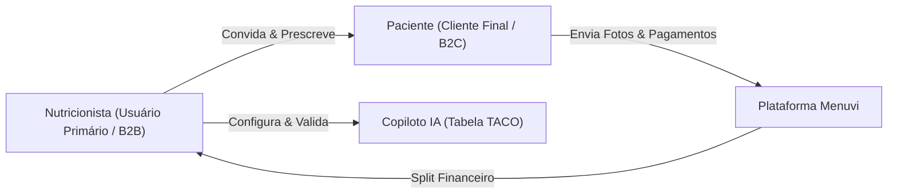
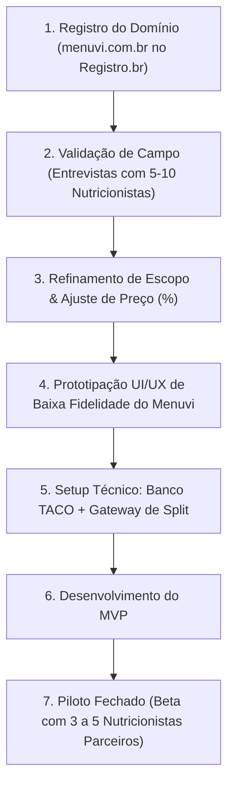

# 🚀 Menuvi — Documento de Planejamento e Especificação Final

> **Marca Oficial:** Menuvi (`menuvi.com.br`)  
> **Posicionamento:** O copiloto inteligente do nutricionista e a ponte diária com o paciente  
> **Status:** Validado e Aprovado para Etapa de Pesquisa/Validação de Campo  
> **Versão:** 1.1.0  
> **Data:** 10/09/2026  
> **Autor/Responsável:** Mateus Serafim  

---

## 1. Sumário Executivo e Visão do Produto

### 1.1 O que é o Menuvi?
O **Menuvi** é uma plataforma B2B2C (Software as a Service + Marketplace) que empodera **nutricionistas** através de Inteligência Artificial para otimizar a prescrição e o acompanhamento nutricional de seus pacientes.

Diferente de aplicativos B2C genéricos que tentam substituir o profissional de saúde gerando dietas autônomas, o Menuvi posiciona a IA como um **copiloto do nutricionista**:
1. O nutricionista se cadastra (com validação ativa de CRN).
2. Convida seus próprios pacientes para o Menuvi.
3. Utiliza a IA alimentada pela Tabela TACO/IBGE para gerar rascunhos de cardápios semanais hiperpersonalizados (respeitando intolerâncias, aversões e metas).
4. O nutricionista **revisa, ajusta e aprova formalmente** o plano antes do paciente visualizá-lo.
5. O paciente consome o plano pelo app do Menuvi e registra suas refeições via fotos, permitindo ao nutricionista auditar a adesão em tempo real.
6. O Menuvi intermedeia pagamentos de consultas e mensalidades dos pacientes com split financeiro automático (modelo marketplace).

### 1.2 Identidade da Marca
* **Nome:** Menuvi
* **Construção:** Fusão harmônica de **Menu** (cardápio, alimentação diária) + **Via / Vida** (caminho saudável, rotina e vitalidade).
* **Domínio Oficial:** `menuvi.com.br` (auditado e 100% disponível para registro no Registro.br).
* **Personalidade da Marca:** Moderna, acolhedora, tecnológica e com autoridade científica.

---

## 2. Público-Alvo e Atores



1. **Nutricionista (Usuário Primário - B2B):**
   - Profissional graduado e registrado no CRN (Conselho Regional de Nutricionistas).
   - Busca produtividade (reduzir tempo de criação manual de cardápios), retenção de clientes e garantia de adesão entre consultas.
2. **Paciente (Usuário Convidado - B2C):**
   - Adulto (18+) acompanhado pelo seu nutricionista de confiança.
   - Só acessa a plataforma mediante convite de um nutricionista cadastrado.
   - Busca conveniência, suporte contínuo e feedback visual sobre sua alimentação diária.

---

## 3. Escopo do MVP (Produto Mínimo Viável)

Para garantir agilidade de lançamento e foco absoluto sem dispersão de recursos, o MVP do Menuvi possui fronteiras rígidas:

### ✅ O que ESTÁ no MVP
- **Autenticação & Validação Profissional:**
  - Cadastro do nutricionista com coleta e checagem de CRN ativo.
  - Termos de adesão e contrato de processamento de dados (DPA).
- **Gestão de Pacientes (Apenas Convite):**
  - Geração de link de convite exclusivo para os pacientes do nutricionista.
  - Onboarding do paciente: anamnese configurável por nutricionista (com template padrão pronto do sistema), restrições alimentares (glúten, lactose, frutos do mar), preferências/aversões e objetivos clínicos definidos em conjunto.
- **Mecanismo de Geração Assistida por IA (Human-in-the-Loop):**
  - Geração de rascunhos de cardápios semanais com gramaturas, macros e micros baseados rigidamente na Tabela TACO (UNICAMP) e IBGE.
  - Guardrails estritos: a IA nunca inventa calorias ou composições; consulta banco de dados relacional indexado.
  - Editor visual para o nutricionista alterar substituições, quantidades e observações clínicas.
  - Trava de segurança: o plano **só é publicado para o paciente após o botão "Aprovar e Assinar"** do nutricionista.
- **Acompanhamento por Fotos (Diário Alimentar):**
  - Paciente fotografa as refeições realizadas e marca status ("Consumido conforme plano", "Substituição", "Exceção").
  - Painel do nutricionista com timeline diária de adesão de cada paciente.
- **Intermediação e Split de Pagamentos:**
  - Integração com Gateway de Pagamento homologado (ex: Pagar.me / Stripe / Asaas).
  - Cobrança automática de planos/consultas do paciente, retenção do % do Menuvi e repasse automático da fatia líquida ao nutricionista.

### ❌ O que NÃO ESTÁ no MVP (Backlog Futuro)
- Teleconsulta / Videochamada integrada no app (consultas continuam presenciais ou via canais externos).
- Prontuário eletrônico completo com exames laboratoriais anexados (PEP complexo).
- Gamificação pesada ou rede social pública.
- Acesso aberto a usuários sem nutricionista vinculado.
- Nutrição pediátrica / atendimento a menores de 18 anos.

---

## 4. Requisitos Não Funcionais, Privacidade e LGPD

### 4.1 Conformidade com a LGPD (Lei nº 13.709/2018)
- **Classificação de Dados:** Informações de saúde, restrições médicas e fotos de rotina física/alimentar são **Dados Pessoais Sensíveis** (Art. 5º, II).
- **Divisão de Papéis Jurídicos:**
  - **Nutricionista = Controlador dos Dados:** É quem determina a finalidade do tratamento médico/nutricional de seu paciente.
  - **Menuvi = Operador dos Dados:** Apenas processa, armazena e disponibiliza as informações conforme instruções e contrato com o profissional.
- **Consentimento Informado e Granular:** Telas específicas com aceite de consentimento para tratamento de dados sensíveis na criação de conta do paciente (Art. 11 da LGPD).
- **Portabilidade e Exclusão:** Ferramenta para exportação dos dados do paciente e exclusão definitiva caso solicitado, ressalvada a retenção legal de prontuário obrigatória para o nutricionista.
- **Segurança da Informação:**
  - Criptografia ponta a ponta em trânsito (HTTPS / TLS 1.3).
  - Criptografia em repouso (AES-256 no banco de dados e buckets de armazenamento de fotos).
  - Registro imutável de logs de auditoria (quem gerou, quem aprovou, quem editou o plano).

---

## 5. Matriz Consolidada de Riscos Legais e Mitigações

| Risco Mapeado | Impacto Inicial | Estratégia de Mitigação no Menuvi | Status de Risco |
|:---|:---:|:---|:---:|
| **Exercício Ilegal da Profissão (Lei 8.234/1991)** | 🔴 Crítico | O Menuvi **não prescreve**. Quem prescreve é o nutricionista com CRN válido. A IA atua estritamente como rascunho operacional. | 🟢 Neutralizado |
| **Responsabilidade Civil por Dano à Saúde (CDC)** | 🔴 Alto | A relação clínica é direta entre o nutricionista e seu paciente. O Menuvi responde como provedor de software com logs de conformidade. | 🟢 Muito Baixo |
| **Alucinação / Dados Nutricionais Falsos** | 🔴 Alto | Banco relacional estruturado (TACO/IBGE). IA apenas estrutura os alimentos; valores matemáticos vêm de queries exatas. | 🟢 Neutralizado |
| **Falso Profissional na Plataforma** | 🔴 Alto | Validação obrigatória de dados no Conselho Regional (CRN) e upload de carteira profissional com revisão. | 🟢 Mitigado |
| **Intermediação Financeira (BACEN)** | 🟡 Médio | Utilização de parceiro regulado (Banking as a Service / Gateway de Split) sem custódia direta de valores pelo Menuvi. | 🟢 Mitigado |
| **Vínculo Empregatício (Pejotização)** | 🟡 Médio | Nutricionista atua com plena autonomia: estipula seus preços, seus horários e atende quem desejar sem exclusividade ou subordinação. | 🟢 Mitigado |
| **Bypass do Pagamento (Negociação por fora)** | 🟡 Médio | Valor do Menuvi focado em utilidade indispensável: histórico, IA, fotos e automação que inviabilizam gerir tudo manualmente no WhatsApp. | 🟡 Monitorado |

---

## 6. Histórico de Decisões Estratégicas (Decision Log)

```
[Decisão 01] Pivô de B2C Autônomo para Plataforma B2B2C Centrada no Nutricionista
  - Contexto: No modelo B2C inicial, o app geraria dietas completas com gramatura para pessoas comuns sem profissional.
  - Análise: Infração direta ao Art. 3º da Lei 8.234/1991 (ato privativo do nutricionista) e exposição a processos civis e éticos sem defesa viável.
  - Decisão: Transformar o app em ferramenta de produtividade para nutricionistas credenciados. O profissional é o cliente pagante e o validador ético.

[Decisão 02] Fonte Nutricional Estruturada (Tabela TACO / IBGE) vs. Geração por LLM
  - Contexto: LLMs alucinam conversões calóricas e gramaturas com frequência inaceitável para a saúde humana.
  - Decisão: A Tabela TACO (UNICAMP) é a única fonte da verdade de composição de alimentos. A IA apenas orquestra sugestões; os números são consultados no banco.

[Decisão 03] Modelo Financeiro por Split de Pagamentos (% por transação)
  - Contexto: Nutricionistas em início de carreira têm aversão a mensalidades fixas altas sem garantia de retorno.
  - Decisão: Cobrança vinculada ao sucesso (percentual sobre o valor pago pelo paciente na plataforma), similar ao modelo de marketplace de serviços.

[Decisão 04] Exclusão de Telemedicina/Videochamada no MVP
  - Contexto: Implementar salas de vídeo ao vivo aumentaria a complexidade de infraestrutura e exigiria conformidade com resoluções específicas de teleconsulta.
  - Decisão: O foco do MVP é o acompanhamento assíncrono e a geração de cardápios; a consulta inicial pode ocorrer em qualquer ambiente.

[Decisão 05] Manutenção Estrita do Público Adulto (18+) no MVP
  - Contexto: Avaliada a expansão para atendimento de menores de idade/pediatria com a supervisão de nutricionistas.
  - Análise: O atendimento a menores impõe obrigações do Art. 14 da LGPD (consentimento específico dos pais/responsáveis), compliance com o ECA no armazenamento de fotos e modelos nutricionais pediátricos específicos (curvas da OMS).
  - Decisão: Manter o foco do MVP exclusivamente em adultos (18+) para lançar com máxima velocidade e menor fricção jurídica. Nutrição infantil/adolescente fica como oportunidade para versões futuras.

[Decisão 06] Escolha e Registro da Marca Oficial: MENUVI
  - Contexto: Busca por um nome no "estilo Uber" (único, memorável, sem clichês como o prefixo 'Nutri-') com domínio .com.br comprovadamente desimpedido.
  - Análise: Nomes como 'Nutrify', 'Nutryo' e 'Alimo' colidiam diretamente com marcas já registradas no Brasil ou sites ativos (ex: alimo.com.br).
  - Decisão: Adoção oficial de MENUVI (Menu + Via / Vida). O domínio menuvi.com.br está auditado e 100% disponível para registro no Registro.br.
```

---

## 7. Próximos Passos e Roadmap de Execução



1. **Ação Imediata — Blindagem da Marca:**
   - Efetuar o registro de `menuvi.com.br` no Registro.br (custo padrão de R$ 40/ano).
2. **Fase Atual — Validação de Campo:**
   - Realizar 5 a 10 entrevistas presenciais ou virtuais utilizando o [ROTEIRO-ENTREVISTA-NUTRICIONISTAS.md](./ROTEIRO-ENTREVISTA-NUTRICIONISTAS.md) apresentando o Menuvi.
   - Validar se a dor de montar dietas e acompanhar adesão justifica a taxa percentual da consulta.
3. **Definição de Parcerias Iniciais:**
   - Selecionar 3 nutricionistas para atuarem como *Design Partners* (testadores beta do protótipo).
4. **Início do Desenvolvimento Técnico:**
   - Modelagem do banco de dados relacional com a Tabela TACO normalizada.
   - Integração das APIs de LLM com saída estruturada (JSON schema rígido).
